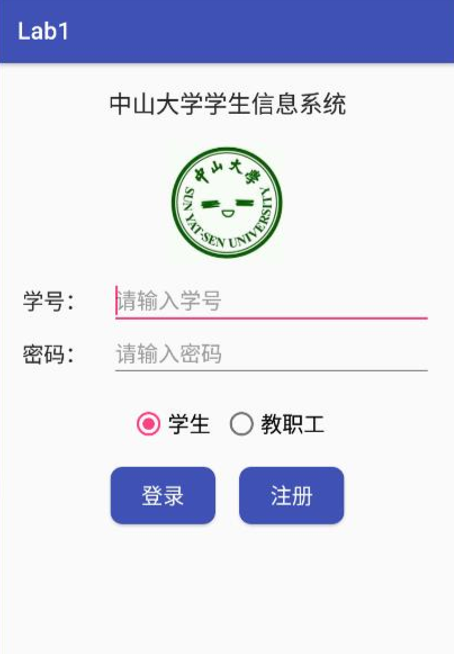
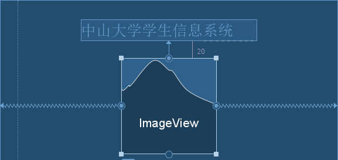
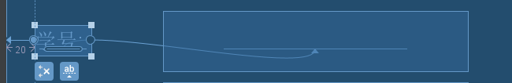
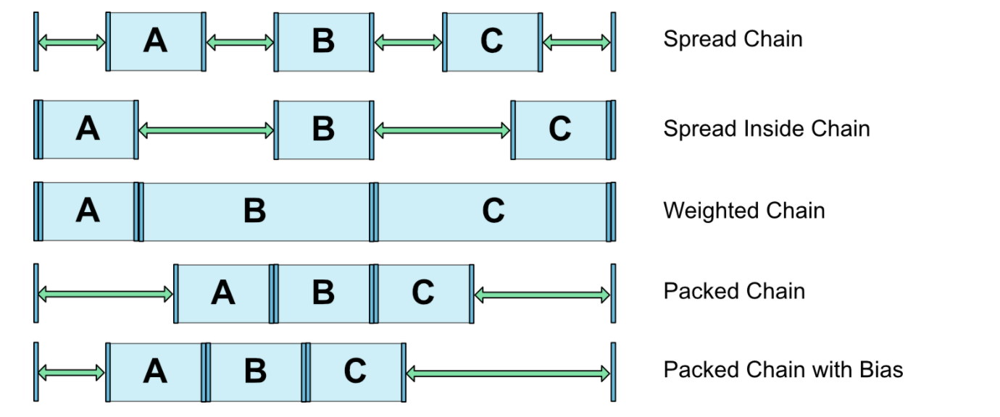
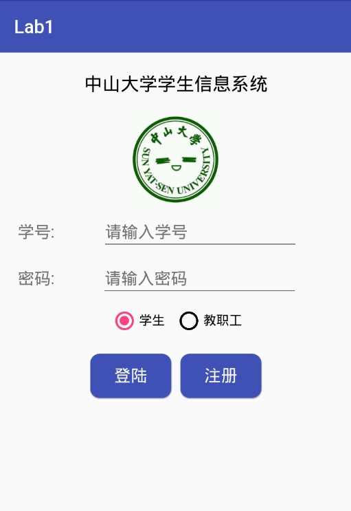

# 移动应用开发实验报告（一）

|    学号    |  姓名  |  班级  |   题目   |     时间     |
| :------: | :--: | :--: | :----: | :--------: |
| 15352306 | 檀祖冰  | 15M3 | 基本UI设置 | 2017/09/18 |

## 实验目的

1. 熟悉 Android Studio 开发工具操作
2. 熟悉 Android 基本 UI 开发,并进行 UI 基本设计

## 实验内容

实现一个 Android 应用，界面呈现如下效果： 

<p style="text-align:center"></p>


要求：

1. 该界面为应用启动后看到的第一个界面  

2. 各控件的要求如下：图片与标题的间距为 20dp，居中；输入框整体距屏幕右边间距 20dp，上下两栏间距 20dp，内 容（包括提示内容）如图所示，内容字体大小 18sp；学号对应的 EditText 只能输入数字，密码对应的 EditText 输入方式为密码；两个单选按钮整体居中，字体大小 18sp，间距 10dp，默认选中的按钮为第一个；两个按钮整体居中，与上方控件间距 20dp，按钮间的间距 10dp，文字大小 18sp。按钮背景框左右边框与文字间距 10dp，上下边框与文字间距 5dp，圆角半径 10dp，背景色为`#3F51B5`  


3. 使用的布局和控件：ConstraintLayout、TextView、EditText、Button、ImageView、RadioGroup、 RadioButton

## 实验过程

### 工程建立与控件使用

* 新建一个Empty项目，使用API版本为25，进入工程后样式文件默认为ConstraintLayout

  在`resources\value\style.xml`处定义App的名字为Lab1，并且，一般来说字符串常量通常全部写到此文件中方便管理

  ```xml
  <resources>
      <string name="app_name">Lab1</string>
  </resources>
  ```

  在工程配置文件处引用定义的app名字、设置app的ICON，并且将`android:name=".MainActivity"`的Activity添加消息过滤器，接受“设置为主启动”的动作，即启动的第一个界面为`MainActivity`.并在在以后的使用中还会在这个文件中添加这个应用程序应有的权限

  `AndroidManifest.xml`内容如下

  ```xml
  <?xml version="1.0" encoding="utf-8"?>
  <manifest xmlns:android="http://schemas.android.com/apk/res/android"
      package="cn.tanzby.lab1">

      <application
          android:allowBackup="true"
          android:icon="@drawable/sysu"
          android:label="@string/app_name"
          android:roundIcon="@mipmap/ic_launcher_round"
          android:supportsRtl="true"
          android:theme="@style/AppTheme">
          <activity android:name=".MainActivity">
              <intent-filter>
                  <action android:name="android.intent.action.MAIN" />
                  <category android:name="android.intent.category.LAUNCHER" />
              </intent-filter>
          </activity>
      </application>
  </manifest>
  ```

* TextView用于基本的文本显示；ImageView用显示基本的中大logo；EditText用于进行学号和密码的输入，其中学号部分需要输入全正整数，使用到xml配置

  ```xml-dtd
  android:inputType="number"
  ```

  而密码框部分使用

  ```xml-dtd
  android:inputType="textPassword
  ```

  可将输入显示为密码遮挡模式。最后，可以添加下面的语句，限制 “学号输入” 输入框最大输入的字符串长度为8

  ```xml-dtd
  android:ems="8"
  ```

  logo图片导入时，直接将`drawable`中导入的图片拖拽到UI视图中即可，然后根据提供的完成品样图，将图片长宽都设置为`100dp`

  在职业选择部分使用控件`RadioGroup`及`RadioButton`，一般在`RadioGroup`中放置`RadioButton`以达到单选的效果。并且，在第一个`RadioButton`使用`android:checked="true"`使得此控件被默认选中。

  ```xml
  <RadioGroup
      android:orientation="horizontal"
      android:layout_width="wrap_content"
      android:layout_height="wrap_content"
      app:layout_constraintTop_toBottomOf="@+id/studentpassword"
      android:id="@+id/radioGroup">
      <RadioButton
          android:id="@+id/radioButton1"
          android:layout_width="wrap_content"
          android:layout_height="wrap_content"
          android:checked="true"
          android:text="学生"
          />
      <RadioButton
          android:id="@+id/radioButton2"
          android:layout_width="wrap_content"
          android:layout_height="wrap_content"
          android:text="教职工" />
  </RadioGroup>
  ```

  最后是两个按钮“登陆”和“注册”，都使用了`Button`控件。为了设置圆角效果，使用了外部xml文件声明实现类型为rectangle的`<shape>`后，并在Button中添加为`background`的方式，除此，在`<shape>`中声明`padding`等样式可调整Button中内边框和文字的距离

  ```xml
  <?xml version="1.0" encoding="utf-8"?>
  <shape xmlns:android="http://schemas.android.com/apk/res/android"
      android:shape="rectangle">
      <solid android:color="#3f51b5"/>
      <padding
          android:left="10dp"
          android:top="5dp"
          android:right="10dp"
          android:bottom="5dp" />
      <corners
          android:radius="10dp"/>
  </shape>
  ```


### 各控件的约束调整

* 在约束布局中，确定一个控件的位置主要通过两个步骤

  1. 确定对其的父元素
  2. 调整边距及其他

  对于控件`ImageView`，由要求可知：“图片与标题的间距为 20dp，居中”。即确定了父元素为**标题**，实现的代码如下

  ```xml
  <ImageView
  	android:id="@+id/imageView"
  	android:layout_width="100dp"
  	android:layout_height="100dp"
  	app:srcCompat="@drawable/sysu"
  	app:layout_constraintTop_toBottomOf="@+id/textView"
  	app:layout_constraintLeft_toLeftOf="parent"
  	app:layout_constraintRight_toRightOf="parent"
  	android:layout_marginTop="20dp" />
  ```

  在布局中使用`app:layout_constraintTop_toBottomOf="@+id/textView`指定当前控件( ImageView )的顶部约束到 textView 的底部，并使用`android:layout_marginTop="20dp"`指定两者相距20dp. 而语句

  ```xml-dtd
  app:layout_constraintLeft_toLeftOf="parent"
  app:layout_constraintRight_toRightOf="parent"
  ```

  分别要求当前控件左对其父元素的左边，右对齐右元素的右边，得到的结果是整个控件**居中对齐**父元素，生成的UI约束布局为

  <p style="text-align:center"></p>

  ​

  输入框旁边的提示文字与输入框同时也是需要竖直对齐的，令用于输入项目提示用的TextView控件基线对其到输入框的基线，即可取得比较好的对齐效果

  <p style="text-align:center"></p>

  ​

  在实现两个间距为`10dp`的、在职业选择项下方的按钮时，先将第一个按钮使用约束条件确定位置，然后使用基线对齐的方法将第二个按钮水平对齐到第一个按钮，然后将两个按钮组合为`chain`，实现水平居中。第一个按钮配置如下

  ```xml
  <Button
      android:id="@+id/bnt_sign_in"
      android:layout_width="wrap_content"
      android:layout_height="wrap_content"
      android:background="@drawable/radiusbutton"
      android:text="登陆"
      android:textColor="@android:color/white"
      android:textSize="18sp"
      app:layout_constraintHorizontal_chainStyle="packed"
      app:layout_constraintLeft_toLeftOf="parent"
      app:layout_constraintRight_toLeftOf="@+id/bnt_register"
      app:layout_constraintTop_toBottomOf="@+id/radioGroup" 
      android:layout_marginRight="10dp"
      android:layout_marginTop="20dp"/>
  ```

  其中将按钮左侧约束对齐到父元素的左侧，顶部约束对齐到RadioGroup的底部，左侧约束对其到第二个按钮的左侧。并设置链条的模式。各种`chain`的风格如下

  ​

  <p style="text-align:center"></p>

  ​

  在这里，配置chain为`packed`风格，直接在第一个按钮处添加风格配置，并设置`layout_marginRight`即可实现两个按钮相隔10dp的效果。但要注意在第二个按钮中需要添加对应的设置——设置左侧对齐第一个button的右侧，并且设置右侧约束到父元素的右侧，这样就可以实现两个按钮的水平方向居中。最后添加基线对齐到第一个Button使得两个按钮竖直方向对齐。第二个按钮的样式如下：

  ```xml
  <Button
      android:id="@+id/bnt_register"
      android:layout_width="wrap_content"
      android:layout_height="wrap_content"
      android:background="@drawable/radiusbutton"
      android:text="注册"
      android:textColor="@android:color/white"
      android:textSize="18sp"
      app:layout_constraintBaseline_toBaselineOf="@+id/bnt_sign_in"
      app:layout_constraintLeft_toRightOf="@+id/bnt_sign_in"
      app:layout_constraintRight_toRightOf="parent" />
  ```


## 实验结果

<p style="text-align:center"></p>

## 实验体会

第一次实验主要是熟悉Android Studio以及约束布局(constrainLayout)的基本使用,而 AS会帮助我们生成必要的Java文件。在使用约束布局的时候，只需要确定某一个控件的对其元素，确定与对其元素的边距，即可确定一个控件在布局中的位置。对比相对布局和线性布局，约束布局更像是相对布局升级版，而且比线性布局灵活不少，在各种屏幕上的表现更是比前二者高出一个层次。而且，可以在约束布局的视图中，通过鼠标连接约束点的方式，确定约束，可谓是十分方便了。


