# 移动应用开发实验报告（二）

|    学号    |  姓名  |  班级  |  题目  |     时间     |
| :------: | :--: | :--: | :--: | :--------: |
| 15352306 | 檀祖冰  | 15M3 | 基本事件 | 2017/10/11 |

[TOC]

## 实验目的

1. 了解Android 编程基础
2. 熟悉 ImageView、Button、RadioButton 等基本控件，能够处理这些控件的基本事件 
3. 学会弹出基本的对话框，能够定制对话框中的内容，能对确定和取消按钮的事件做处理 

## 实验内容

实现一个 Android 应用，界面呈现如下效果： 

<p style="text-align:center">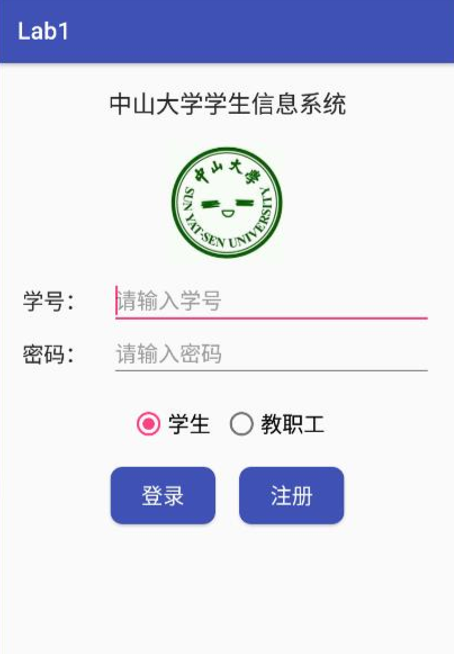</p>


要求：

1. 该界面为应用启动后看到的第一个界面  

2. 输入学号和密码的控件要求用 TextInputLayout 实现 


3.  点击图片，弹出对话框如下图： 

   点击“拍摄”选项，弹出 Toast 信息“您选择了[拍摄]”； 
   点击“从相册选择”选项，弹出 Toast 信息“您选择了[从相册选择]； 
   点击“取消”按钮，弹出 Toast 信息“您选择了[取消]”

4.  切换 RadioButton 的选项，弹出 Snackbar 提示“您选择了 xx”； 
   例如从选项“学生”切换到选项“教职工”，则提示“您选择了教职工”； 

   点击 Snackbar 上的“确定”按钮，则弹出 Toast 信息“Snackbar 的确定按钮被点击了” 

5. 点击登录按钮 

   依次判断学号是否为空，密码是否为空，用户名和密码是否正确（正确的学号和密
   码分别为“123456”，“6666”）；不正确则给出错误信息，如学号和密码都正确则提
   示“登陆成功”，如图： 

6. 点击注册按钮 

   如果切换选项时，RadioButton 选中的是“学生”，那么弹出 Snackbar 信息“学生注册
   功能尚未启用”，如果选中的是“教职工”，那么弹出 Toast 信息“教职工注册功能尚未
   启用”。 

## 实验过程

### 输入框

* 这一部分使用到`TextInputLayout`, 打开Grade Scripts部分的build.gradle(Module:app) 在文件中的dependencies添加新的编译项

  ```css
  compile 'com.android.support:design:25.3.1'
  ```

  然后执行`sync now`

* 在以前的输入控件外加上`TextInputLayout`

  ```xml
  <android.support.design.widget.TextInputLayout
          android:layout_width="match_parent"
          android:layout_height="wrap_content">
          <EditText
                    
              <!--...-->
    
              />
      </android.support.design.widget.TextInputLayout>
  ```

* 修改原来的EditText样式

  内部的输入控件，长度和宽度全部match父元素，父元素的width设置为0即可。也要注意，一个TextInputLayout只能放入一个EditText控件。此外，EditText不必设置约束，只需要设置TextInputLayout的约束即可。

  ```xml
  <android.support.design.widget.TextInputLayout
          android:layout_width="0dp"
          android:layout_height="wrap_content"
          android:id="@+id/TIL_studentnumber"
          android:layout_marginTop="8dp"
          app:layout_constraintTop_toBottomOf="@+id/imageView"
          android:layout_marginLeft="8dp"
          app:layout_constraintLeft_toLeftOf="parent"
          android:layout_marginRight="8dp"
          app:layout_constraintRight_toRightOf="parent">

          <EditText
              android:id="@+id/studentnumber"
              android:layout_width="match_parent"
              android:layout_height="match_parent"
              android:ems="10"
              android:hint="请输入学号"
              android:inputType="number"

              />
      </android.support.design.widget.TextInputLayout>

      <android.support.design.widget.TextInputLayout
          android:layout_width="0dp"
          android:layout_height="wrap_content"
          android:id="@+id/TIL__studentpassword"
          android:layout_marginTop="8dp"
          app:layout_constraintTop_toBottomOf="@+id/TIL_studentnumber"
          android:layout_marginLeft="8dp"
          app:layout_constraintLeft_toLeftOf="parent"
          android:layout_marginRight="8dp"
          app:layout_constraintRight_toRightOf="parent">
      <EditText
          android:id="@+id/studentpassword"
          android:layout_width="match_parent"
          android:layout_height="match_parent"
          android:ems="10"
          android:inputType="textPassword"
          android:hint="请输入密码"
           />
      </android.support.design.widget.TextInputLayout>
  ```


### 事件编写

在xml中主要是配置了界面的布局，但是还需要在Java代码中定义每一个元素的事件，具体来说，要实现这次实验的要求，需要经过以下的步骤


#### 声明使用的控件及绑定

在代码中获取xml中定义的控件一般使用`findViewById()`方法，如获取方才新建的输入框Layout及其中的EditText

在MainActivity下声明全局变量,  `TIL_Id`为学号输入框对应的TextInputLayout，`stuId`为学号输入框对应的文字输入控件

```java
private TextInputLayout TIL_Id;
private EditText stuId;
```

####使用接口绑定到xml对应的控件上

使用findViewById()方法获取控件，在TextInputLayout中有一个获取其中EditText控件的方法，当然也可以直接采用findViewById()的方法获取。而在xml中只需要设置好控件的id即可。部分代码如下

*activity_main.xml*

```xml
<android.support.design.widget.TextInputLayout
    android:id="@+id/TIL_studentnumber"
    <!-- other code -->
    <EditText
        android:id="@+id/studentnumber"
        <!-- other code -->
        />
    </android.support.design.widget.TextInputLayout>

<android.support.design.widget.TextInputLayout
    android:id="@+id/TIL__studentpassword"
	<!-- other code -->
    <EditText
        android:id="@+id/studentpassword"
        <!-- other code -->
         />
</android.support.design.widget.TextInputLayout>
```

*MainActivity.java*

```java
private TextInputLayout TIL_Id;
private EditText stuId;
@Override
protected void onCreate(Bundle savedInstanceState) {
  super.onCreate(savedInstanceState);
  setContentView(R.layout.activity_main);
  init();  // 初始化控件选择
}

private void init()
{
  //other code....
  
  TIL_Id=(TextInputLayout) findViewById(R.id.TIL_studentnumber);
  stuId=TIL_Id.getEditText();
  
  TIL_Id.setError("学号不能为空");
}
```

#### 控件事件绑定

各个控件对应的事件一般如下，由于需要实现的方法简单，直接采用**匿名函数**的方式作为事件响应函数即可

* ImageView、Button的点击事件`setOnClickListener`

  ```java
  Button.setOnClickListener(new View.OnClickListener() {
    @Override
    public void onClick(View v) {
    	//TO-DO
    }
  });
  ```

* RadioGroup及RadioButton的监听事件`setOnCheckedChangeListener()`

  ```java
  IndentifySel.setOnCheckedChangeListener(new RadioGroup.OnCheckedChangeListener() {
    @Override
    public void onCheckedChanged(RadioGroup group, @IdRes int checkedId) {
      //TO-DO
    }
  });
  ```

由于有很多过程中都需要知道当前RadioButton选中的是*学生*还是*教职工*，可以设置一个Boolean类型的参数`isStudent`记录每次RadioGroup发生改变后的值是多少, 需要注意系统中所有控件的ID都是以一个整形数值来记录的所以只需要比较checkedId的值是否等于R.id.radioButton1的值即可判断是否选中了这个控件。

而在监听函数`onCheckedChanged()`中，第一个参数位置为对应发生响应的RadioGroup的控件所在ID，，第二个参数`checkedId`为被激活(或者说被选中)的RadioButton的控件ID号。而在每一个选择发生变化时，使用`Snackbar`提示改变，Snackbar是一个方便提醒的消息提示控件，为了统一风格及简化代码，特此封装一个显示Snackbar提示的函数.

```java
private void showInfo_Snackbar(View v,String  info)
{
  Snackbar.make(v.getRootView(), info,Snackbar.LENGTH_SHORT)
          .setAction("确定", new View.OnClickListener() {
            @Override
            public void onClick(View v) {
            	//TO-DO
            }
          })
          .setDuration(5000)
          .setActionTextColor(Color.WHITE)
          .show();
}
```

在这里使用Snackbar内建的`make(View view,CharSequence text,int duration)`作消息提示,   而第一个参数位置填入的`View`为*The view to find a parent from*，也就是要显示消息的载体，可以使用控件接口`getRootView()`获取控件最顶上的根元素；接着使用`setAction()`设置一个“确定键”，第一个参数确定按钮的名字，第二个参数给这个按钮设置事件，在这里创建了onClick但是内容为空。

```java
IndentifySel.setOnCheckedChangeListener(new RadioGroup.OnCheckedChangeListener() {
  @Override
  public void onCheckedChanged(RadioGroup group, @IdRes int checkedId) {
    isStudent = checkedId == R.id.radioButton1;
    showInfo_Snackbar(group.getRootView(), 
                      "您选择了"+ (isStudent ? "学生" : "教职工") );
  }
});
```

完成以上的代码，`isStudent`得到更新，此时注册按钮可以设置事件

```java
registBnt.setOnClickListener(new View.OnClickListener() {
    @Override
    public void onClick(View v) {
    String showStr = (isStudent ? "学生" : "教职工")+"注册功能尚未启用";
    if(isStudent)  showInfo_Snackbar(v,showStr);
    else Toast.makeText(getApplicationContext(),showStr,Toast.LENGTH_SHORT)
              .show();
    }
});
```

而登陆按钮的逻辑检测思路为

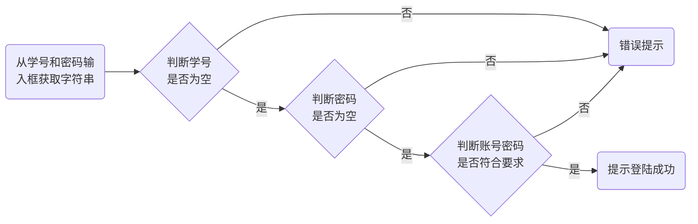

要进行错误提示，直接将对应的TextInputLayout设置`setError()`即可，需要注意的是，使用这个接口后，`setErrorEnabled(true)`在内部会自动调用，但记得在不需要提示的时候，把`setErrorEnabled`设置为false,关掉错误提示。**但这样做的话，会导致在输入时错误提醒一直存在！**

> 做法应当是在给EditText设置监听事件！

这里使用`TextWatcher`与`addTextChangedListener()`共同设置监听输入事件，而*TextWatcher*本身提供了三个接口

​	**1. 文本改变前：** *beforeTextChanged()*
​	**2.文本改变：**onTextChanged()
​	**3.文本改变之后：***afterTextChanged()*

我们只需要使用文本改变即可。即在输入框发生变化的时候，当输入框触发错误提示消失，而且在后期还可以加上各种各样的判断（如格式的正则判断）.

```java
/**** 监听输入框变化 ****/
private TextWatcher update()
{
    return new TextWatcher() {
        @Override
        public void beforeTextChanged(CharSequence s, int start, int count, int after) {}
        @Override
        public void afterTextChanged(Editable s) {}
        @Override
        public void onTextChanged(CharSequence s, int start, int before, int count) {
            TIL_Id.setErrorEnabled(false);
            TIL_Pw.setErrorEnabled(false);
        }
    };
}
```

然后给两个输入框绑定监听

```java
stuPw.addTextChangedListener(update());
stuId.addTextChangedListener(update());
```

登陆按钮的监听事件实现如下

```java
signInBnt.setOnClickListener(new View.OnClickListener() {
@Override
public void onClick(View v) {
    String ID = stuId.getText().toString();
    String PW = stuPw.getText().toString();
    if (ID.isEmpty())       TIL_Id.setError("学号不能为空");
    else if (PW.isEmpty())  TIL_Pw.setError("密码不能为空");
    else if ( Objects.equals(ID, "123456") && Objects.equals(PW, "666")  ){
        TIL_Pw.setErrorEnabled(false);
        Snackbar.make(v.getRootView(), "登陆成功",Snackbar.LENGTH_SHORT).show();
    }
    else{
        TIL_Pw.setErrorEnabled(false);
        Snackbar.make(v.getRootView(), "登陆失败",Snackbar.LENGTH_SHORT).show();
    }
}
});
```

接着是ImageView的点击事件设定，即再点击的时候，弹出一个窗口，而Dialog窗口使用`AlertDialog`控件，代码如下

```java
Gravatar.setOnClickListener(new View.OnClickListener() {
    @Override
    public void onClick(View v) {
        AlertDialog.Builder  dialogBuilder = new AlertDialog.Builder(MainActivity.this)
                .setTitle("上传头像")//设置标题
                .setNegativeButton("取消", new DialogInterface.OnClickListener() {
                    @Override
                    public void onClick(DialogInterface dialog, int which) {
                        Toast.makeText(getApplicationContext(),
                        	"您选择了[取消]",Toast.LENGTH_SHORT).show();
                    }
                })
                .setItems(dialogSelectStr, new DialogInterface.OnClickListener() {
                    @Override
                    public void onClick(DialogInterface dialog, int which) {
                        String showStr ="您选择了["+dialogSelectStr[which]+"]";
                        Toast.makeText(getApplicationContext(),
                        	showStr,Toast.LENGTH_SHORT).show();
                    }
                }).create().show();//创建dialog并让其显示
    }
});
```

Java的一个好处是，可是使用函数式编程，在声明新控件的时候使用一系列的`setXXXX()`

在`setNegativeButton()`和`setItems()`两个接口的第二个参数位置都是一个事件监听函数的接口，在`setNegativeButton()`中的事件响应函数和普通的按钮的事件监听接口函数基本一致，而`setItems()`函数第一个参数位置可以接受一个String字符串数组，让Dialog显示一个字符串列表；而监听接口函数中提供了一个参数位置`int which`，直接提供是第几个String被点击到的信息。

## 实验结果

### ImageView

下面三图片为ImageView分别对应的三个按钮的点击测试结果，可以看到最终都显示出了对应的Toast提示

<div><table class="groupImg" ><tr><td>
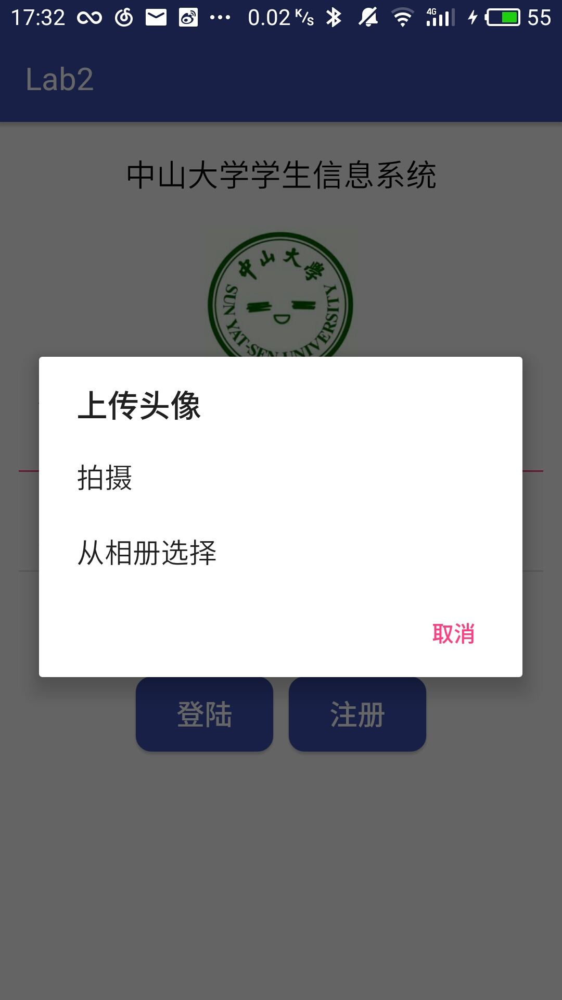
</td>
<td >
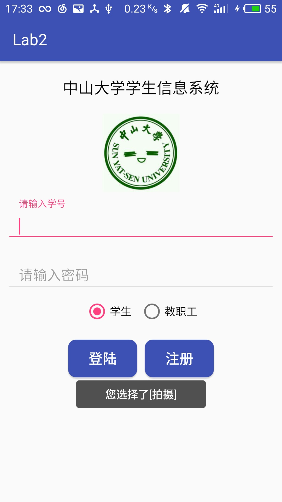
</td>
<td>
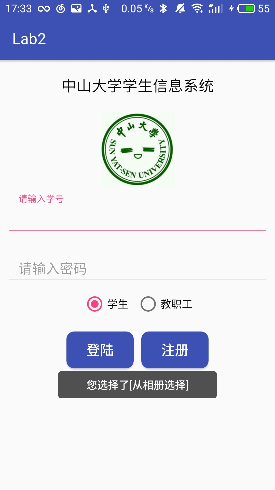
</td>
<td>
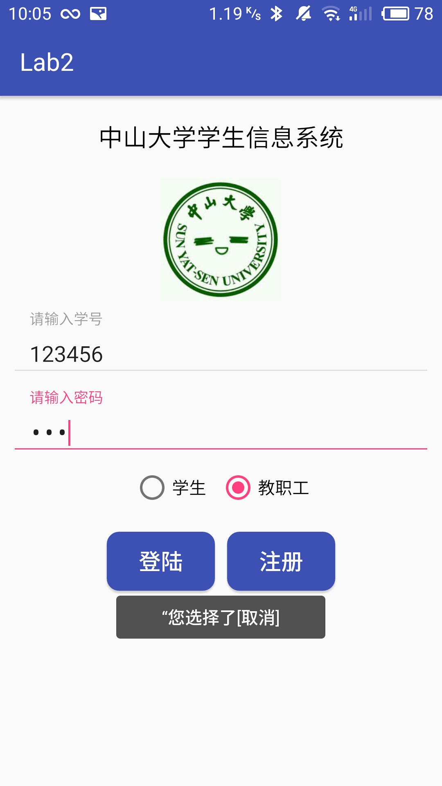
</td>
</tr>
<tr>
<td >
校徽点击弹出Dialog
</td>
<td >
选择“拍摄”按钮
</td>
<td>
选择“从相册选择”按钮
</td>
<td >
选择“取消”按钮
</td>
</tr>

</table></div>

### 登陆按钮测试

<div><table class="groupImg" ><tr><td >
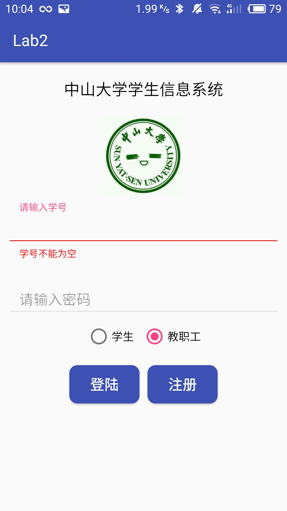
</td>
<td>
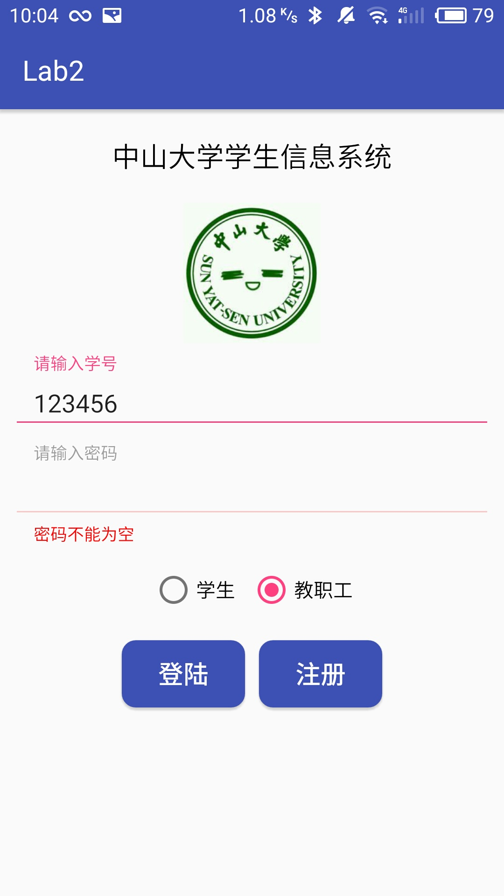
</td>
<td>
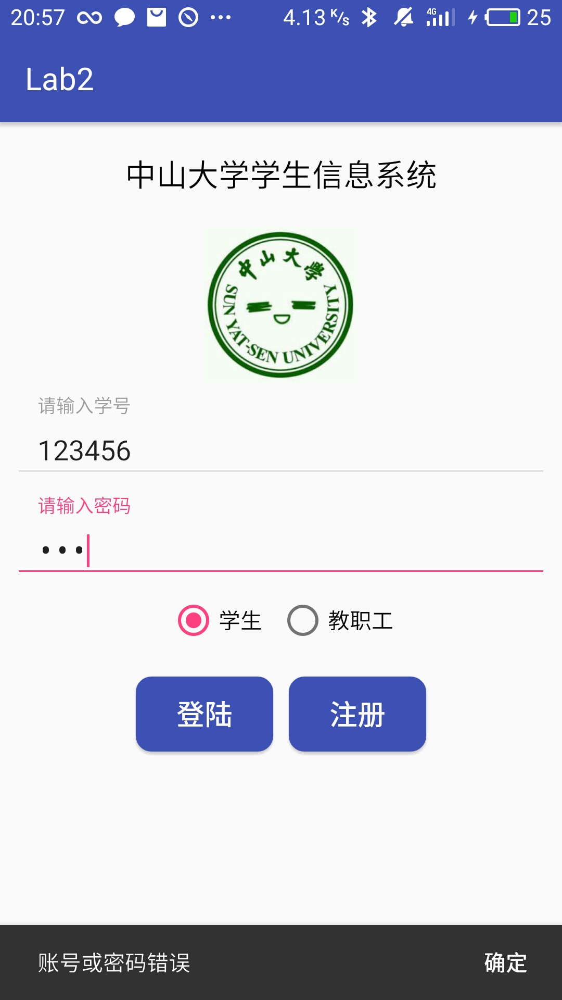
</td>
<td>
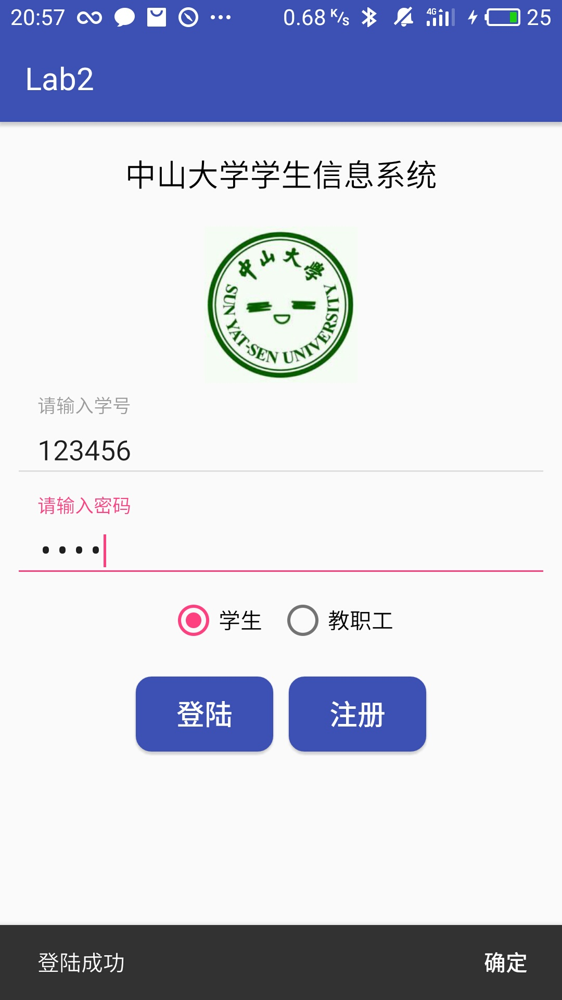
</td>
</tr>
<tr>
<td >
用户名为空
</td>
<td>
密码为空
</td>
<td >
登陆失败
</td>
<td >
登陆成功
</td>
</tr>
</table><div>

### 注册按钮

<div ><table class="groupImg" ><tr><td >
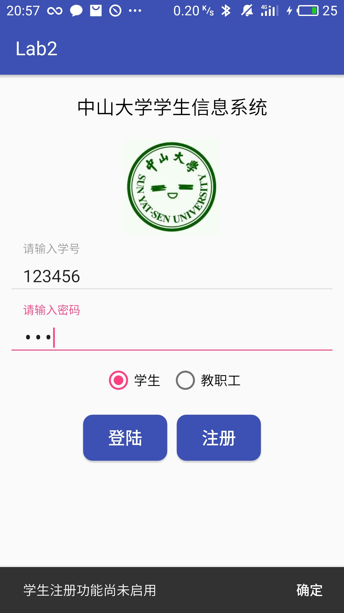
</td>
<td>
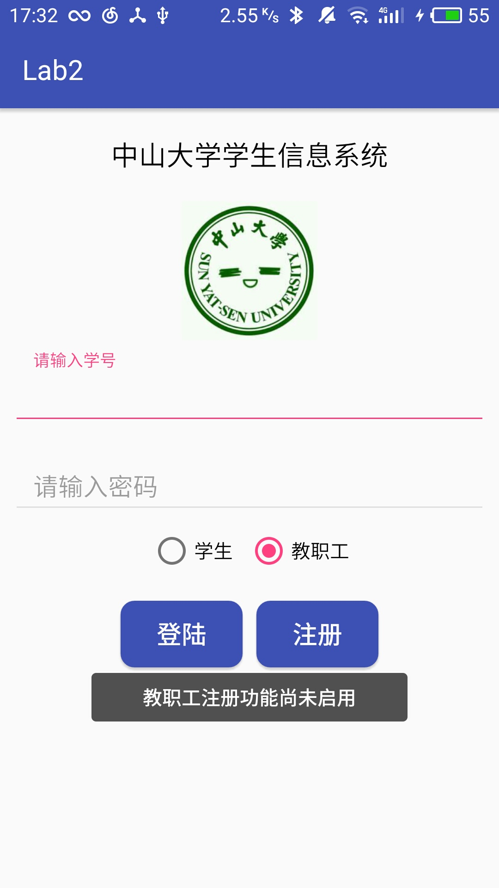
</td>
</tr>
<tr>
<td >
注册按钮学生提示
</td>
<td>
注册按钮教职工提示
</td>
</tr>


