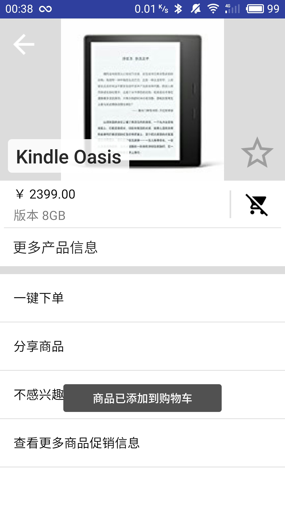

# 移动应用开发实验报告（三）

|    学号    |  姓名  |  班级  |  题目  |     时间     |
| :------: | :--: | :--: | :--: | :--------: |
| 15352306 | 檀祖冰  | 15M3 | 页面跳转 | 2017/10/18 |

## 实验目的

* 复习事件管理
* Intend,Bundle在Activity中的应用
* 学习RecycleListView

## 实验内容

## 实验过程

###引入说明

此次实验引进了一些好用的拓展

* Material design icon  一个生成MD设计风格的矢量图标插件

* butterknife  一个使用装饰器进行样式、事件注入的框架

  在*build.gradle*的*dependencies*中加入

  ```
  compile 'com.jakewharton:butterknife:8.8.1'
  annotationProcessor 'com.jakewharton:butterknife-compiler:8.8.1'
  ```

  向一个控件变量注入样式

  ```java
  @BindView(R.id.floatingActionButton) FloatingActionButton mfab;
  ```

  启用

  ```java
  ButterKnife.bind(this);
  ```

### 项目构成

实验可以分为两个`Activity`

* 商品列表及购物车列表共用的*MainActivity* ,  继承自*AppCompatActivity*
* 显示商品详情的 *ProductDetailActivity* ， 继承自 *AppCompatActivity*

由于使用了两个不同的ListView——RecyclerView和ListView， 所以需要构造两个不同的Adapter为列表提供数据和显示

* RCAdapter  
* LVAdapter

数据管理方面，将商品的数据写在一个`xml`文件中，方便修改

​	

### 各部分实现

#### 商品信息管理

* **建立资源列表**

  将商品资源图片复制到drawable中，改写全部文件名称为小写，接下来可以通过`R.drawable.XX`访问；接着在res下新建一文件夹，新建xml文件，编写类似下面的商品信息

  ```xml
  <?xml version="1.0" encoding="utf-8"?>
  <Products>
      <Product price="￥ 5.00" name = "Enchated Forest" imgURL="enchatedforest">
          <info name = "作者">Johanna</info>
      </Product>
      <Product price="￥ 59.00" name = "Arla Milk" imgURL="arla">
          <info name = "产地">德国</info>
      </Product>
      <Product price="￥ 79.00" name="Devondale Milk" imgURL="devondale">
          <info name = "产地">澳大利亚</info>
      </Product>
      <Product price="￥ 2399.00" name="Kindle Oasis" imgURL="kindle">
          <info name ="版本">8GB</info>
      </Product>
      <Product price="￥ 179.00" name="waitrose 早餐麦片" imgURL="waitrose">
          <info name="重量">2Kg</info>
      </Product>
      <Product price="￥ 14.90" name="Mcvitie's 饼干" imgURL="mcvitie">
          <info name ="产地">英国</info>
  </Products>
  ```

* **在程序中管理**

  在应用中使用资源，可以先构建一个资源类`class Product`，然后将xml文件的信息读取到资源类中

  新建资源类*public class Product*,  类的基本结构为

  <p style="text-align:center"></p>

  ​

  类中包含一个读取xml文件到Product列表中的函数，主要使用`XmlResourceParser`与`XmlPullParser`组合，即**Pull**的方式读取xml文件，xml读取的一般规律是

  ```mermaid
  graph LR
  	de{判断当前标签<br>xrp.getEventType&#40&#41}
  	de-->a
  	de-->b
  	de-->c
  	de-->d
  	dosomething[相应处理]-->next
  	next[下一项<br>xml.next&#40&#41]
  	a[START_DOCUMENT]-->dosomething
  	b[START_TAG]-->dosomething
  	c[END_TAG]-->dosomething
  	d[TEXT]-->dosomething
  	
  ```

  ```java
  public static final  List<Product> getDataFromXMLSource(Context context,int xmlFilePath)
  {
    Product p = null;
    List<Product> productList=null;
    XmlResourceParser xrp = context.getResources().getXml(xmlFilePath);
    try {
      while(xrp.getEventType() != XmlPullParser.END_DOCUMENT){
        switch (xrp.getEventType()) {
          case XmlPullParser.START_DOCUMENT:
            productList = new ArrayList<Product>();
            break;
          case  XmlPullParser.START_TAG:
            String tagName = xrp.getName();
            if (tagName.equals("Product")){
              p = new Product();// 创建新Product item
              p.setPrice(xrp.getAttributeValue(null,"price"));// 获取价格
              p.setName(xrp.getAttributeValue(null,"name"));// 获取商品名字
              String imgName = xrp.getAttributeValue(null, "imgURL");
              p.setImgObject(
                      R.drawable.class.getField(imgName).getInt(null));
            }
            else if (tagName.equals("info")){
              assert p != null;
              String typeName = xrp.getAttributeValue(null,"name");
              xrp.next();
              String typeInfo = xrp.getText();
              p.setSpecialInfo(typeName+" "+typeInfo);
            }
            break;
          case XmlPullParser.END_TAG:
            if (xrp.getName().equals("Product")) {
              assert productList != null;
              productList.add(p);
              p = null;
            }
            break;
          case XmlPullParser.TEXT:
            break;
        }
        xrp.next();// 获取解析下一个
      }
    } catch (XmlPullParserException
          | IOException
          | IllegalAccessException
          | NoSuchFieldException e) {
      e.printStackTrace();
    }
    return productList;
  }
  ```

  由于**Product类**还必须支持Activity间的传递，可以使用实现一个**Parcelable**接口方法。

  接口需要重写三个方法

  * **describeContents()**   用于描述对象

  * **writeToParcel()**   称为”序列化“,   此方法不存在写布尔类型变量的方法，使用`writeInt() `替代，相应地，在下面的反序列化时，需要`source.readInt()==1`这样的写法

  * **Parcelable.Creator<Product>** 从 “写” 的数据中重新构建<Product>， 称为”反序列化“ 注意，反序列化的属性的顺序必须和之前写入的顺序一致


  在传递Product对象时，就可以写成

  * *发送端*

    ```java
    Intent newInten = new Intent().setClass(MainActivity.this,ProductDetailActivity.class);
    newInten.putExtra("PRODUCT",mAdapter.getItems(position));//发送数据
    startActivityForResult(newInten,1);//启动intent
    ```

  * *接收端*

    ```java
    Product curProduct = (Product)  this.getIntent().getParcelableExtra("PRODUCT");
    ```

  *Product.class*

  ```java
  public class Product implements Parcelable{
      @Override
      public int describeContents() {
          return 0; }
      @Override
      public void writeToParcel(Parcel dest, int flags) {
          dest.writeInt(imgObject);  dest.writeInt(is_add_to_shopList ? 1 : 0);
          dest.writeInt(is_favorite ? 1 : 0);  dest.writeString(SpecialInfo);
          dest.writeString(name);  dest.writeString(price);
      }
      public static final Parcelable.Creator<Product> CREATOR 
              = new Parcelable.Creator<Product>(){
          @Override
          public Product createFromParcel(Parcel source) {
              Product product = new Product();
              product.imgObject=source.readInt();
              product.is_add_to_shopList=source.readInt()==1;
              product.is_favorite=source.readInt()==1;
              product.SpecialInfo=source.readString();
              product.name=source.readString(); 
              product.price=source.readString();
              return product;
          }
          @Override
          public Product[] newArray(int size) { return new Product[size]; }
      };
  }
  ```

至此，已经可以在项目中方便地管理每一个Product

#### RecyclerView与ListView

两个列表的adapter构造如下


<p text-align="center"></p>

<p text-align="center"></p>

两个adapter都需要实现的有

- 每一项的点击长按事件接口声明
- 数据列表的读写

按照Adapter的功能，RCVadapter的实现过程为

* **声明内置变量**

  按照需求，Adapter内应有一个Data的List，以及程序所在的”上下文“

  ```java
  private Context mContext;
  private List<Product> itemList;
  ```

* **数据处理**

  数据的读写访问，`notifyItemRemoved()`移除视图中的第position项

  ```java
  public void removeData(int position) {
  	itemList.remove(position);
  	notifyItemRemoved(position);
  }
  ```

  获取item以及返回大小，注意返回大小时

  ```java
  public Product getItems(int position){
     return itemList == null?null:itemList.get(position);
  }
  @Override
  public int getItemCount() {
    return itemList == null?0:itemList.size();
  }
  ```

* **列表事件绑定**

  需要在Adapter内部声明两个接口，用于外部定义列表项的点击和长按事件

  第一步是创建接口

  ```java
  public interface OnItemClickLitener{
  	void onItemClick(View view, int position);
  	void onItemLongClick(View view , int position);
  }
  ```

  新建内部类，用于外部调用，定义事件

  ```java
  public void setOnItemClickLitener(OnItemClickLitener mOnItemClickLitener){
  	this.mOnItemClickLitener = mOnItemClickLitener;
  }
  ```

  接着为Adapter实例化接口抽象类

  ```java
  private OnItemClickLitener mOnItemClickLitener;
  ```

* **ViewHolder**

  简单理解，**ViewHolder为一个小的Layout**，装载着一个列表项，如一个列表项包含了两个TextView

  ```java
  public static class VH extends RecyclerView.ViewHolder {
    TextView fullProductName;
    TextView firstCharOfProductName;
    public VH(View itemView) {
      super(itemView);
      firstCharOfProductName= (TextView)itemView.findViewById(R.id.id_ItemFirstChar);
      fullProductName = (TextView)itemView.findViewById(R.id.id_ItemFullName);
    }
  }
  ```

  `onCreateViewHolder()`接口用于创建一个列表项，样式表*R.layout.items_view_for_rc*为列表项样式

  ```java
  @Override
  public VH onCreateViewHolder(ViewGroup parent, int viewType)
  {
      VH h = new VH(LayoutInflater
              .from(mContext)
              .inflate(R.layout.items_view_for_rc, parent,false));
      return h;
  }
  ```

  当实例化一个列表项时，完成列表项内控件的**内容改写**和**事件绑定**

  ```java
  @Override
  public void onBindViewHolder(final VH holder, int position) {
      holder.fullProductName.setText( itemList.get(position).getName() );
      holder.firstCharOfProductName.setText(
              itemList.get(position).getName().substring(0,1).toUpperCase());
      if (mOnItemClickLitener != null) {
          holder.itemView.setOnClickListener(new View.OnClickListener() {
              @Override
              public void onClick(View v) {
                  int pos = holder.getLayoutPosition();
                  mOnItemClickLitener.onItemClick(holder.itemView, pos);
          }});

          holder.itemView.setOnLongClickListener(new View.OnLongClickListener() {
              @Override
              public boolean onLongClick(View v) {
                  int pos = holder.getLayoutPosition();
                  mOnItemClickLitener.onItemLongClick(holder.itemView, pos);
                  return false;
          }});
      }
  }
  ```

ListView的Adapter实现类似上述过程，构建列表项的接口变成了`getView()`


需要自行声明一个ViewHolder，仿照RecyleView的过程，在这一个类中，包含了一个列表项的所有控件，通过这个类的点运算获取，并设置相关属性。

```java
private static class ViewHolder{
  TextView mTextView;
  TextView mfirstText;
  TextView mPrice;
}
```

在ListView中，使用`convertView`的``setTag()`与`getTag()`提高运行效率，即相关的xml绑定只进行一次

```java
public View getView(final int position, View convertView, ViewGroup parent) {
  ViewHolder holder = null;
  if (convertView == null) {
    holder = new ViewHolder();
    //...  xml binding issue (findViewById)
    convertView.setTag(holder);
  } else {
    holder = (ViewHolder) convertView.getTag();
  }
  if (mOnItemClickLitener != null){
    final View finalConvertView = convertView;
    convertView.setOnClickListener(...);
    convertView.setOnLongClickListener(...);
  }
  // holder.XXX.setText....
  return convertView;
}
```

####应用逻辑

#####  界面

实验中有三个界面，其中商品主界面和购物车界面共用一个Activity，通过**设置隐藏**来选择显示，跳转到商品详情界面则使用Intend即可。界面的”切换“事件绑定在一按钮上，在每次“切换”界面时，只需使用 `setVisibility()` 设置Layout的隐藏属性即可，在Home界面切换到购物车界面界面时，更新购物车列表数据。

````java
mfab.setOnClickListener(new View.OnClickListener() {
    @Override
    public void onClick(View v) {
    if (mAllProductList.getVisibility()==View.INVISIBLE){ /*当前处在购物车界面*/
        mAllProductList.setVisibility(View.VISIBLE);
        mShoppingCarList.setVisibility(View.INVISIBLE);
        mfab.setImageResource(R.drawable.ic_shopping_cart_white_48dp);
    } else{/*当前处在Home界面*/
        updateShoppingList();
        mAllProductList.setVisibility(View.INVISIBLE);
        mShoppingCarList.setVisibility(View.VISIBLE);
        mfab.setImageResource(R.drawable.ic_home_white_48dp);
    }}
});
````

 ##### 数据更新

主要的页面跳转逻辑图如下


 

> 购物车与商品主页面使用的Product列表不是同一个，在Product 的属性中，定义两个属性，分别用于标记此商品是否标记为“喜欢”和是否标记为“已添加购物车”，在每次修改完成数据库相关的操作后，调用函数更新购物车的Product列表，使用的方法为遍历所有商品，然后按标识添加购物车。这样做是为了使得原商品列表中的任何修改，都可以直接影响到购物车列表。所以，商品主页面使用的数据列表被当成中心的数据库


在*ProductDetailActivity*与*MainActivity*之间传递数据时，将会一起传递当前选中的商品在商品列表的**编号**和商品自身**实例**，传递编号的原因是方便根据返回后修改值修改商品的属性。在商品详情页面返回主界面时，将是否喜欢和是否添加到购物车的布尔值压到一个布尔数组中，进行传递

  

*MainActivity商品列表部分发送处理*

```java
Intent newInten = new Intent().setClass(MainActivity.this,ProductDetailActivity.class);
newInten.putExtra("PRODUCT",mAdapter.getItems(position));//发送数据
newInten.putExtra("PRODUCT_Position",position);
startActivityForResult(newInten,1);//启动intent
```

*MainActivity购物车部分发送处理*

```java
Intent newInten = new Intent().setClass(MainActivity.this,ProductDetailActivity.class);
newInten.putExtra("PRODUCT",mAdapter_ShoppingList.getItem(position));//发送数据
newInten.putExtra("PRODUCT_Position",searchProductPosition(position));
startActivityForResult(newInten,1);//启动intent
```

*MainActivity部分接收处理*

```java
@Override
protected void onActivityResult(int requestCode, int resultCode, Intent data) {
super.onActivityResult(requestCode, resultCode, data);
  if (requestCode == 1 && resultCode == 1){
    /*update  product*/
    int index = data.getIntExtra("PRODUCT_Position",-1);
    boolean[] result = data.getBooleanArrayExtra("backInfo");
    mAdapter.getItems(index).setIs_add_to_shopList(result[0]);
    mAdapter.getItems(index).setIs_favorite(result[1]);
    updateShoppingList();
  }
}
```

*ProductDetailActivity部分发送*

```java
Intent intent = getIntent();
intent.putExtra("backInfo",new boolean[]{is_Add,is_Favor});
intent.putExtra("PRODUCT_Position",curProductPos);
setResult(1,intent);
finish();
```

在商品界面，长按删除商品,，结合之前声明的`onItemLongClick()`接口和`removeData()`实现

```java
mAdapter.setOnItemClickLitener(
  new RCAdapter.OnItemClickLitener() {
    @Override
    public void onItemClick(View view, int position) {
      //...
    }

    @Override
    public void onItemLongClick(View view, final int position) {
      Toast.makeText(MainActivity.this,
                    "移除第"+(position+1)+"个商品",
                    Toast.LENGTH_SHORT)
           .show();
      mAdapter.removeData(position);
    }
  }
);
```

以上涉及到的功能函数有

- `searchProductPosition()`  根据购物车List的商品名字，查找对应在商品列表中商品的位置
- `updateShoppingList()`    遍历商品列表中商品，将标记为添加到购物车的商品添加到购物车的数据列表中

#### 布局

##### 主界面

主界面使用约束布局，并添加

* *RecyclerView*   高度设置为“包含内容”，宽度为“0dp”, 上、左、右约束到父元素

* *FloatingActionButton*  

  设置如下

  ```xml
      <android.support.design.widget.FloatingActionButton
          android:id="@+id/floatingActionButton"
          android:layout_width="wrap_content"
          android:layout_height="wrap_content"
          android:clickable="true"
          android:src="@drawable/ic_shopping_cart_white_48dp"
          app:fabSize="normal"
          android:layout_marginRight="32dp"
          app:layout_constraintRight_toRightOf="parent"
          app:layout_constraintBottom_toBottomOf="parent"
          android:layout_marginBottom="64dp"
          android:layout_marginEnd="32dp" />
  ```

* *ListView*     高度设置为“包含内容”，宽度为“0dp”, 下、左、右约束到父元素

商品项样式

每一个商品列表项其实是一个小的布局，可以使用约束布局来绘制

*items_view_for_rc.xml*

```xml
<?xml version="1.0" encoding="utf-8"?>
<android.support.constraint.ConstraintLayout xmlns:android="http://schemas.android.com/apk/res/android"
    xmlns:app="http://schemas.android.com/apk/res-auto"
    xmlns:tools="http://schemas.android.com/tools"
    android:layout_width="match_parent"
    android:layout_height="80dp"
    android:layout_marginTop="20dp"
    android:layout_marginLeft="10dp"
    android:layout_marginRight="10dp"
    android:background="@drawable/shadow">
    <TextView
        android:id="@+id/id_ItemFirstChar"
        android:layout_width="50dp"
        android:layout_height="50dp"
        android:background="@drawable/circle"
        android:gravity="center"
        android:layout_marginLeft="10dp"
        android:layout_marginBottom="8dp"
        android:layout_marginTop="8dp"
        app:layout_constraintLeft_toLeftOf="parent"
        app:layout_constraintTop_toTopOf="parent"
        app:layout_constraintBottom_toBottomOf="parent"
        android:textSize="20sp"
        android:textColor="#fff"/>

    <TextView
        android:id="@+id/id_ItemFullName"
        android:layout_width="180dp"
        android:layout_height="50dp"
        android:gravity="center_vertical|left"
        android:layout_marginRight="18dp"
        android:layout_marginBottom="8dp"
        android:layout_marginTop="8dp"      
        android:textColor="#000"
        android:textSize="20sp"
        app:layout_constraintRight_toRightOf="parent"
        app:layout_constraintBottom_toBottomOf="parent"
        app:layout_constraintTop_toTopOf="parent"
        android:textStyle="bold"
        />

</android.support.constraint.ConstraintLayout>
```

绘制圆形图案只需要将第一个TextView 的背景设置为圆形的`<shape> `  

*circle.xml*

```xml
<?xml version="1.0" encoding="utf-8"?>
<shape xmlns:android="http://schemas.android.com/apk/res/android"
    android:shape="oval">
    <solid
        android:color="@color/colorPrimary"/>
    <size
        android:width="50dp"
        android:height="50dp"/>
</shape>
```


##### 购物车界面

设置购物车顶部   

需要在顶部放置两个TextView说明表项，ListView中有方法`addHeaderView()`可以传入一个View对象作为列表头部

```java
View headView = inflater.inflate(R.layout.shoppinglist_head, null);
mShoppingCarList.addHeaderView(headView);
```

其中*R.layout.shoppinglist_head* 大致的框架为

```xml
<?xml version="1.0" encoding="utf-8"?>
<android.support.constraint.ConstraintLayout 
      ...>

    <TextView
        android:id="@+id/productName_tag"
        android:text="商品"
        ...
        />

    <TextView
        android:id="@+id/price_tag"
        android:text="价格"
        ...
        />
</android.support.constraint.ConstraintLayout>
```

设置购物车列表项样式

这里共有三项——圆形图标、商品名字, 以及商品价格，与上部分所诉相似不再说明

#####商品详情

商品详情部分，需要将头部设置为占据高度的三分之一, 但这一部分又要设置为相对布局，于是页面布局框架为

````xml
<LinearLayout
  ...
  >
  <RelativeLayout
    android:id="@+id/Top_Detail"
    android:layout_width="match_parent"
    android:layout_height="0dp"
    android:layout_weight="1">
  </RelativeLayout>
  
  <LinearLayout
    android:layout_width="match_parent"
    android:layout_height="0dp"
    android:layout_weight="2"
    android:orientation="vertical">
  </LinearLayout>
  
</LinearLayout>
````

  

分隔条可以使用一个空的ImageView，通过填充颜色实现效果

```xml
<ImageView
  android:id="@+id/split2"
  android:layout_width="350dp"
  android:layout_height="1dp"
  android:layout_alignParentBottom="true"
  android:layout_centerHorizontal="true"
  android:background="#1E000000" />
```

   

设置底部ListView间隔条style通过修改下面的语句实现

* android:dividerHeight=“1px”      修改分隔条高度
* android:divider="#1E000000"    修改分隔条颜色


在其余部分，根据相对关系调整即可


## 实验结果

<div><table class="groupImg" ><tr><td >

</td>
<td>

</td>
<td>

</td>
</tr>
<tr>
<td class="c">
商品界面
</td>
<td class="c">
添加购物车
</td>
<td class="c">
购物车
</td>
</tr>
</table><div>

<div><table class="groupImg" ><tr><td >

</td>
<td>

</td>
<td>

</td>
</tr>
<tr>
<td class="c">
长按删除商品项
</td>
<td class="c">
已删除一个商品的购物车
</td>
<td class="c">
删除购物车项
</td>
</tr>
</table><div>

