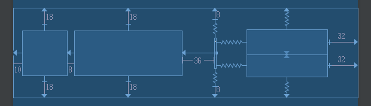
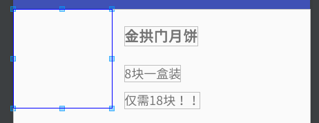
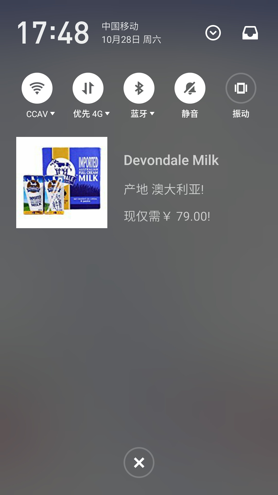
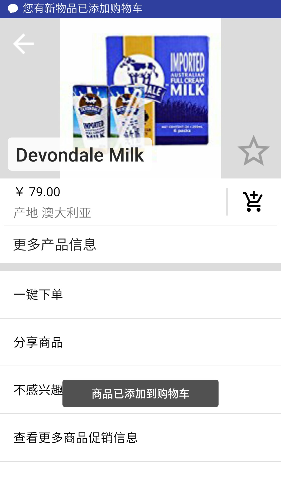
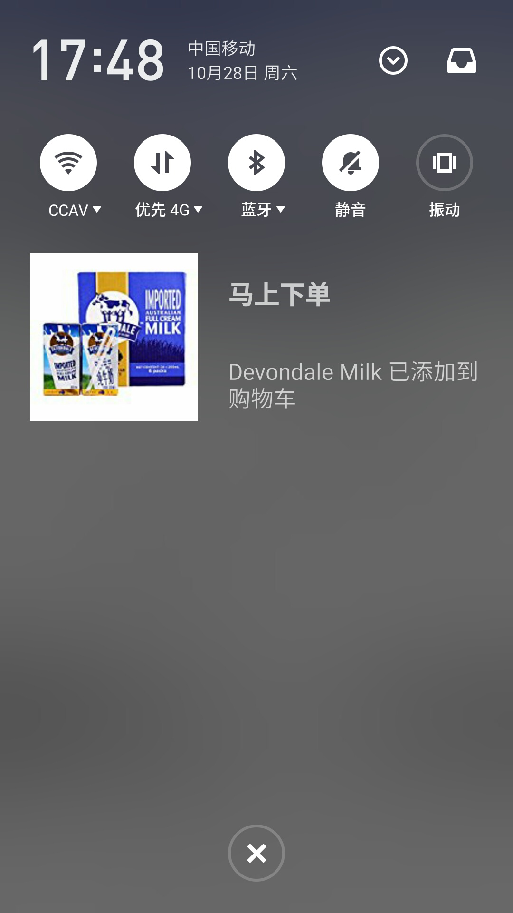
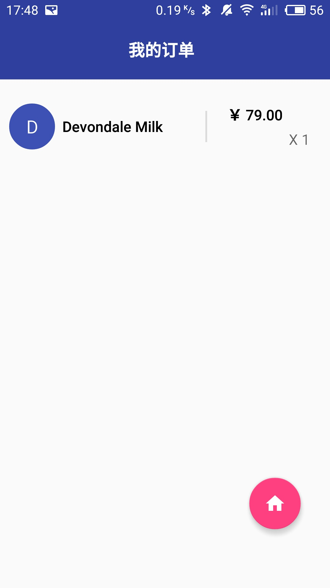
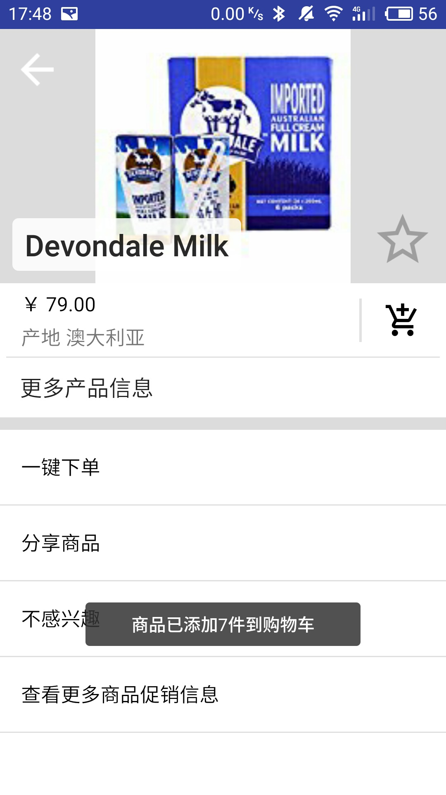

# 移动应用开发实验报告（四）

|    学号    |  姓名  |  班级  |  题目  |     时间     |
| :------: | :--: | :--: | :--: | :--------: |
| 15352306 | 檀祖冰  | 15M3 | 广播使用 | 2017/10/28 |


## 实验目的

* 掌握 Broadcast 编程基础
* 掌握动态注册 Broadcast 和静态注册 Broadcast
* 掌握Notification 编程基础
* 掌握 EventBus 编程基础

## 实验内容

* 在启动应用时,会有通知产生,随机推荐一个商品
* 点击通知跳转到该商品详情界面
* 点击购物车图标,会有对应通知产生,并通过Eventbus在购物车列表更新数据
* 点击通知返回购物车列表
* 实现方式要求:启动页面的通知由静态广播产生,点击购物车图标的通知由动态广播产生

## 实验过程

### 重新规划*Product*类与相关方法

* 替换Product类中的成员布尔值*Is_add_to_shopList*为记录购买数量的整形变量*purchaseNumber*并新增方法

  ```java
  public void setPurchaseNumber(Integer purchaseNumber);
  public Integer getPurchaseNumber();
  ```

* 更新与其相关的方法，将传“是否添加到购物车”改为传递已购商品的数量

* 更新购物车布局

  <p style="text-align:center"></p>

### 推荐商品产生

* 右键工程`new--other--Broadcast Recevier`新建一名为*productRecommand*的广播接收类，并在`AndroidManifest.xml`中改写相关的配置为

  ```xml
  <receiver
    android:name=".productRecommand">
    <intent-filter>
    	<action android:name="StaticFilter" />
    </intent-filter>
  </receiver>
  ```

  这表明*productRecommand*将会接收实例接收Action名字为 <u>StaticFilter</u>  的广播

* 发送一个随机商品到广播接收类

  ```java
  //生成商品序号
  Integer randomID = new Random().nextInt(productList.size());
  //建立名为StaticFilter的广播
  Intent BroadcastIntent =  new Intent("StaticFilter");
  //传入发送携带的数据
  BroadcastIntent.putExtra("PRODUCT",productList.get(randomID));
  BroadcastIntent.putExtra("PRODUCT_Position",randomID);
  //发送
  sendBroadcast(BroadcastIntent);
  ```

* 接着在*productRecommand*的`onReceive`中接收MainActivity中传来的商品数据，在函数中加入

  ```java
  curProduct = (Product) intent.getParcelableExtra("PRODUCT");
  Integer curProductPos = intent.getIntExtra("PRODUCT_Position", -1);
  ```

* 设置一个Notification去显示商品信息，由于API=22，故使用`notification.bigContentView`自定义一个通知视图，定义一个通知的样式（*remote_view.xml*）为

  <p style="text-align:center"></p>

  接着

  ```java
  remoteView = new RemoteViews(context.getPackageName(), R.layout.remote_view);
  remoteView.setImageViewResource(R.id.notiimage, curProduct.getImgObject());
  remoteView.setTextViewText(R.id.notititle,curProduct.getName());
  remoteView.setTextViewText(R.id.notitext,curProduct.getSpecialInfo()+"!");
  remoteView.setTextViewText(R.id.notitext2,"现仅需"+curProduct.getPrice()+"!");

  Notification notification = new Notification.Builder(context)
                              .setContentIntent(contentIntent)
                              .setSmallIcon(R.drawable.arla)
                              .setTicker("清仓大甩卖")
                              .build();
  notification.bigContentView = remoteView; //API22
  ```

  当然需要设置点击通知跳转的Intent

  ```java
  Intent sendIntend;
  sendIntend = new Intent().setClass(context, ProductDetailActivity.class);
                  sendIntend.putExtra("PRODUCT",curProduct);//发送数据
                  sendIntend.putExtra("PRODUCT_Position", curProductPos);
  PendingIntent contentIntent = PendingIntent.getActivity(
                                context, 0, sendIntend, 
                                PendingIntent.FLAG_UPDATE_CURRENT);
  ```

  通过添加`FLAG_UPDATE_CURRENT`让Intent马上到达所需到达的Activity

  最后通过通知栏管理器发送

  ```java
  mNotifyMgr.notify(notifyNo+=1, notification);
  ```

* 最后的商品页面无需任何修改，即可正常跳转到

### 通过EvenBus传输数据

* 在`build.gradle`中新添加

  ```xml
  compile 'org.greenrobot:eventbus:3.0.0'
  ```

* 在MainActivity.java中注册

  ```java
  EventBus.getDefault().register(this);
  ```

  在结束Activity的时候要取消注册,即重写`onDestroy()`,  此外动态广播也是要被取消注册的

  ```java
  EventBus.getDefault().register(this);
  ```

* 新建一个消息类, 通过这个类来传递商品的相关属性

  ```java
  public class productMessageEvent     {
      public Integer productIndex;//商品的编号
      public Integer productPurchaseNum;//商品的购买数量
      public Boolean isProductFavor;//商品是否被标记为喜欢
  	
      public productMessageEvent(Product product,Integer productIndex) {
          this.productPurchaseNum=product.getPurchaseNumber();
          this.isProductFavor=product.getIs_favorite();
          this.productIndex=productIndex;
      }
  }
  ```

  在详情页面需要重写购物车点下去的触发的事件

  ```java
  Add.setOnClickListener(new View.OnClickListener() {
      @Override
      public void onClick(View v) {
        if(curProduct.getPurchaseNumber()==0) {
            Toast.makeText(ProductDetailActivity.this,
                    "商品已添加到购物车",Toast.LENGTH_SHORT).show();
        }
        else
        {
            Toast.makeText(ProductDetailActivity.this,
                    "商品已添加"+(curProduct.getPurchaseNumber()+1)+"件到购物车",
                    Toast.LENGTH_SHORT)
                    .show();
        }
        curProduct.setPurchaseNumber(curProduct.getPurchaseNumber()+1);
        /*每次都广播更新的商品信息*/
        EventBus.getDefault().post(new productMessageEvent(curProduct,curProductPos));
   	}
  });
  ```

  发送的数据在MainActivity中被接收,  在MainActivity中增下以下的函数用于订阅信息。其中*onMessageEvent*为自定义的名字，*threadMode = ThreadMode.MAIN*为接收数据所使用的线程的类型。在接受了数据之后，直接更新“数据库”的结果。

  ```java
  @Subscribe(threadMode = ThreadMode.MAIN)
  public void onMessageEvent(productMessageEvent event){
    mAdapter.getItems(event.productIndex).setPurchaseNumber(event.productPurchaseNum);
    mAdapter.getItems(event.productIndex).setIs_favorite(event.isProductFavor);
    updateShoppingList();
  }
  ```


### 添加购物车通知+跳转到购物车

* 在MainActivity中注册一个动态的名为 *DynamicFilter* 的Broadcast，这个Broadcast与之前的静态的Broadcast是同一个程序，但可以通过两个不同的方法去使得它接受广播

  ```java
  productRecommand_ = new productRecommand();
  IntentFilter intentFilter = new IntentFilter("DynamicFilter");
  registerReceiver(productRecommand_,intentFilter);
  ```

* 当添加购物车事件被触发时,   广播商品信息，并使得名为  *DynamicFilter*  的广播接收器可以接收。在上一步已经注册了此接收器

  ```java
  Intent BroadcastIntent =  new Intent("DynamicFilter");
  BroadcastIntent.putExtra("PRODUCT",curProduct);
  BroadcastIntent.putExtra("PRODUCT_Position",curProductPos);
  sendBroadcast(BroadcastIntent);
  ```

* 在*productRecommand* 中，获取广播信息的名字，并根据这个名字判断广播来自什么地方（因为现在只有两个广播发射点）

  ```java
  receiveType = intent.getAction();
  ```

* 解Intent并创建前往购物车的Intent

  ````java
  curProduct = (Product) intent.getParcelableExtra("PRODUCT");//传商品
  Integer curProductPos = intent.getIntExtra("PRODUCT_Position", -1);//传商品位置
  Intent sendIntend = new Intent().setClass(context, MainActivity.class );
  sendIntend.putExtra("OPENLIST",true);  // 设置OPENLIST参数为true
  									   // 让MainActivity切换为购物车
  contentIntent = PendingIntent.getActivity(
                  context, 0, sendIntend, PendingIntent.FLAG_UPDATE_CURRENT);
  remoteView = new RemoteViews(context.getPackageName(), R.layout.remote_view);
  emoteView.setTextViewText(R.id.notititle,"马上下单");
  remoteView.setTextViewText(R.id.notitext2,curProduct.getName()+" 已添加到购物车");
  remoteView.setTextViewText(R.id.notitext,"");
  Notification notification = new Notification.Builder(context)
                              .setContentIntent(contentIntent)
                              .setSmallIcon(R.drawable.arla)
                              .setTicker("您有新物品已添加购物车")
                              .build();// getNotification()
  notification.bigContentView = remoteView;  // API<=22
  mNotifyMgr.notify(notifyNo+=1, notification);
  ````

  此外在设置自定义的View的时候，由于手机API版本版本号在在23之下，设置自定义View使用 bigContentView 进行设置，设置的样式与静态的共用同一个

* 在MainActivity中重写方法`void onNewIntent(Intent intent)` 

  ```java
  @Override
  protected void onNewIntent(Intent intent)
  {
    boolean openList =  intent.getBooleanExtra("OPENLIST",false);
    if (openList){ /*判断是需要主界面还是购物车*/
      updateShoppingList();
      mAllProductList.setVisibility(View.INVISIBLE);
      mShoppingCarList.setVisibility(View.VISIBLE);
      mfab.setImageResource(R.drawable.ic_home_white_48dp);
    }
    else{/*当前处在Home界面*/
      mAllProductList.setVisibility(View.VISIBLE);
      mShoppingCarList.setVisibility(View.INVISIBLE);
      mfab.setImageResource(R.drawable.ic_shopping_cart_white_48dp);
    }
  }
  ```

  当有前往MainActivity的Intent中包含有OPENLIST项时更新购物车列表，并切换界面到购物车

##实验结果

<div><table class="groupImg" ><tr><td>

</td>
<td>

</td>
<td>

</td>
</tr>
<tr>
<td class="c">
随机推荐
</td>
<td class="c">
点击进入详情
</td>
<td class="c">
添加购物车
</td>
</tr>
<tr><td>

</td>
<td>

</td>
<td>

</td>
</tr>
<tr>
<td class="c">
进入购物车
</td>
<td class="c">
点击购物车中商品进入详情并添加商品
</td>
<td class="c">
返回购物车
</td>
</tr>
</table><div>

##​实验总结

- 使用notification时，需要注意一下几点才可以正常显示通知

  - 必须要添加smallIcon、Title、Text
  - API最好是对应的，现在版本在安卓8.0的模拟器上无法发送通知

  由于API版本太低故无法完成 “本次实验中必须实现的部分是标题、大图标、内容、小图标” 的内容，改用RemoteView定义。

- notification的自定义RemoteView不能使用新的约束布局，因为这个方法只支持API22及以下的

- 注意跳转的逻辑设置，不能说出现了商品已经添加到购物车的通知，就来一个广播告诉主界面要切换到购物车


