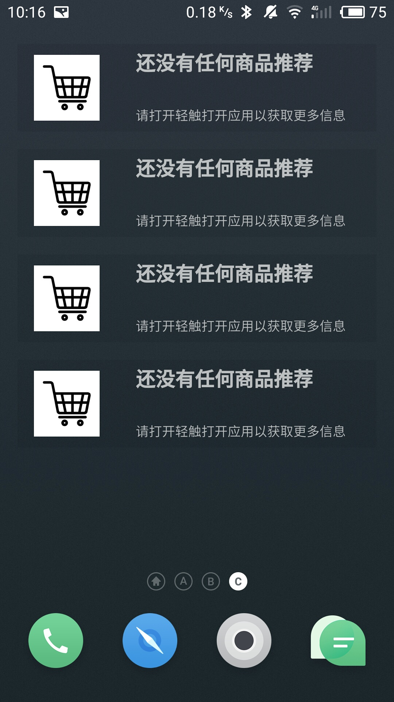
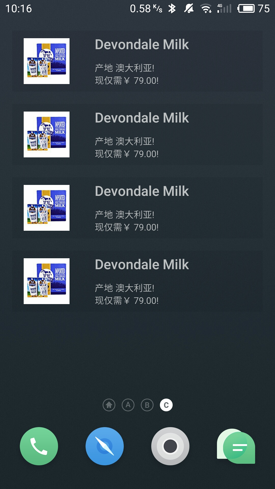
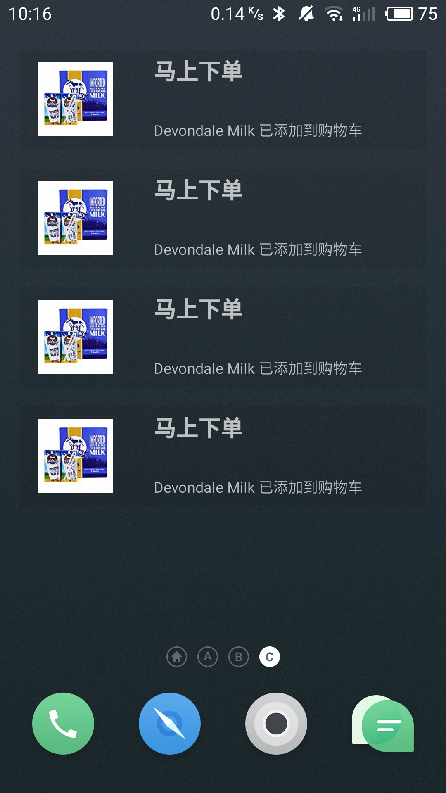

# 移动应用开发实验报告（五）

|    学号    |  姓名  |  班级  |  题目   |     时间     |
| :------: | :--: | :--: | :---: | :--------: |
| 15352306 | 檀祖冰  | 15M3 | 小部件使用 | 2017/10/31 |


## 实验目的

* 掌握 AppWidget 编程基础
* 掌握 Broadcast 编程基础
* 掌握动态注册 Broadcast 和静态注册 Broadcast

## 实验内容

实现一个Android 应用，实现静态广播、动态广播两种改变widget 内容的方法。在上次实验的基础 上进行修改，所以一些关于静态动态广播的内容会简略。 

* widget 初始情况包含一个默认图片及字符。
* 点击widget可以启动应用，并在widget随机推荐一个商品。
* 点击widget跳转到该商品详情界面。
* 点击购物车图标，widget相应更新。
* 点击widget跳转到购物车界面。

## 实验过程

小部件的使用方法与通知的使用方法基本一致，与实验四重叠部分省略

#### 注册Widget

右键工程,  直接新建一个Widget，接着在*AndroidManifest.xml*的Widget配置中加入与通知相同的过滤器

```xml
<receiver android:name=".NewAppWidget">
  <intent-filter>
  	<action android:name="StaticFilter" />
  	<action android:name="android.appwidget.action.APPWIDGET_UPDATE" />
  </intent-filter>

  <meta-data
  	android:name="android.appwidget.provider"
  	android:resource="@xml/new_app_widget_info" />
</receiver>
```

在MainActivity中注册此小部件接收动态广播

```java
productRecommand_ = new productRecommand();
productWidget_    = new NewAppWidget();
IntentFilter intentFilter = new IntentFilter("DynamicFilter");

registerReceiver(productRecommand_,intentFilter);
registerReceiver(productWidget_   ,intentFilter);
```
#### 设置事件

添加全局变量,  因为此程序的所有小部件都是一样的所以使用static，同时这样写还可以允许这些变量在`static void updateAppWidget()`中使用

```java
private static final String SA = "StaticFilter";
private static final String DA = "DynamicFilter";
private static String  receiveType;
private static Product curProduct;
private static RemoteViews remoteView;
```

继承AppWidgetProvider，构建子类`NewAppWidget`, 重写方法onReceive，使得小部件可以接收与通知相同的数据更新广播。添加`super.onReceive(context,intent)`使得widget响应系统广播`"android.appwidget.action.APPWIDGET_UPDATE"`,  调用updateAppWidget初始化布局。

```java
@Override
public void onReceive(Context context,Intent intent)
{
  receiveType = intent.getAction();
  ReceiveDataAndHandle(context,intent);
  assert receiveType!=null;
  switch (receiveType)
  {
    case DA:/*intend去往购物车*/
    	sendProductAddToListInfo(context);
    	break;
    case SA:/*intend去往详情*/
    	sendRecommand(context);
    	break;
  }
  super.onReceive(context,intent);//注意添加
}
```

为NewAppWidget添加点击事件，将小部件的布局层与pendingIntend绑定到事件，使得点击整个小部件都有响应.

```java
remoteView.setOnClickPendingIntent(R.id.notification_layout,contentIntent);
```

小部件的内容更新与通知的一致，但是更新方式有区别.将remoteView配置好之后，更新界面。

*发送推荐*

```java
private void  sendRecommand(Context context)
{
    remoteView.setTextViewText(R.id.notititle, curProduct.getName());
    remoteView.setTextViewText(R.id.notitext, curProduct.getSpecialInfo()+"!");
    remoteView.setTextViewText(R.id.notitext2,  "现仅需"+curProduct.getPrice()+"!");
    AppWidgetManager appWidgetManager=AppWidgetManager.getInstance(context);
    ComponentName CN = new ComponentName(context,NewAppWidget.class);
    appWidgetManager.updateAppWidget(CN,remoteView);
}
```

*发送下单消息*

```java
private void sendProductAddToListInfo(Context context)
{
    remoteView.setTextViewText(R.id.notititle,"马上下单");
    remoteView.setTextViewText(R.id.notitext2,curProduct.getName()+" 已添加到购物车");
    remoteView.setTextViewText(R.id.notitext,"");
    AppWidgetManager appWidgetManager=AppWidgetManager.getInstance(context);
    ComponentName CN = new ComponentName(context,NewAppWidget.class);
    appWidgetManager.updateAppWidget(CN,remoteView);
}
```

重写updateAppWidget，使用appWidgetManager更新界面，在widget被添加之后，需要初始化widget界面，可以由*super.onReceive(context,intent);*内部调用onUpdate进而调用updateAppWidget更新widget

```java
static void updateAppWidget(Context context, AppWidgetManager appWidgetManager,
                            int appWidgetId) {
    if(remoteView==null)
    {
        remoteView = new RemoteViews(context.getPackageName(), R.layout.remote_view);
        Intent intent = new Intent(context,MainActivity.class);
        PendingIntent pendingIntent = PendingIntent.getActivity(context,0,intent,0);
        remoteView.setOnClickPendingIntent(R.id.notification_layout,pendingIntent);
        remoteView.setTextViewText(R.id.notititle, "还没有任何商品推荐");
        remoteView.setTextViewText(R.id.notitext2,"请打开轻触打开应用以获取更多信息");
        remoteView.setImageViewResource(R.id.notiimage,R.drawable.shoplist);
    }
    // Instruct the widget manager to update the widget
    appWidgetManager.updateAppWidget(appWidgetId, remoteView);
}
```


## 实验结果

<div><table class="groupImg" ><tr><td >

</td>
<td>

</td>
<td>

</td>
</tr>
<tr>
<td class="c">
应用widget初始样式，点击可进入应用
</td>
<td class="c">
进入应用后更新widget为推荐商品
</td>
<td class="c">
添加商品到购物车中，widget更新
</td>
</tr>
</table><div>

## 实验总结

widget的使用与notification几乎一致——除了更新的方式有所不同

* notification使用notify进行更新
* widget使用appWidgetManager进行更新

在widget的使用中遇到了新增widget时，界面没有按照代码逻辑进行更新的问题，经检查是因为遗漏了onReceive中调用super.onReceive导致没有进行界面更新。

在两次实验中，我都使用了RemoteView自定义通知和widget的界面。需要注意的是，这两者都是属于Recevier类型的，并不是View。

