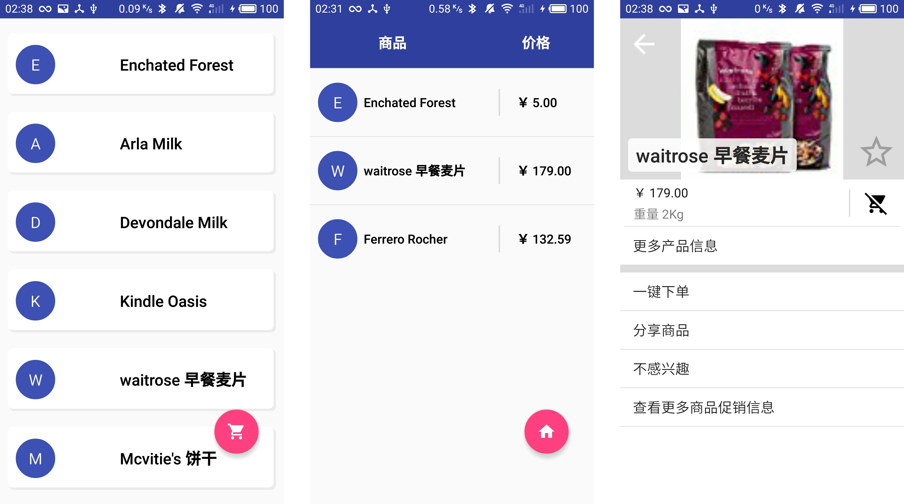

###主要涉及

* xml文件读取
* 自定义类的监听接口
* Parcelable 传递
* 列表(RecyclerView和ListView)的使用
* butterknife框架初体验

### 效果图

*移动的同学们应该去上上新媒体设计，尤其是应用开发的TA们，最后一张实在是限制太多救不回来了 🙂*

### ！！！！

目前(2017年10/22   02点48分)还没有整理代码会有很多垃圾愚蠢以及冗余的code....= =