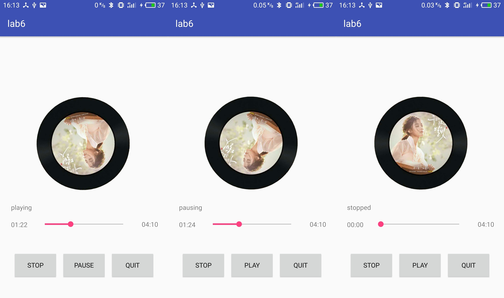

# 移动应用开发实验报告（六）

|    学号    |  姓名  |  班级  |  题目  |     时间     |
| :------: | :--: | :--: | :--: | :--------: |
| 15352306 | 檀祖冰  | 15M3 | 服务与  | 2017/11/16 |

[TOC]

## 实验目的

* 学会使用MediaPlayer
* 学会使用简单多线程编程，使用Handle更新UI
* 学会使用Service后台工作
* 学会使用Service与Activity进行通信

## 实验内容

实现一个简单的播放器，要求有功能：

* 播放、暂停、停止和退出功能
* 后台播放功能
* 进度条显示播放进度，拖动进度条改变进度功能
* 播放时图片旋转，显示当前播放时间

## 实验过程

#### 创建音乐播放类

* 通过*NEW*新建一个名为MusicServer的服务

  * 添加一个MediaPlayer并设置媒体路径，并进行初始化工作。

    ```java
    public MusicService() {
        mBinder = new MyBinder();
        if (player==null) {
            player = new MediaPlayer();
        }

        try {
            String path = Environment.getExternalStorageDirectory() + "/melt.mp3";
            player.setDataSource(path);
            player.prepare();
            player.seekTo(0);
            player.setLooping(true);
        } catch (Exception e) {
            e.printStackTrace();
        }
    }
    ```

    使用`Environment.getExternalStorageDirectory()`前先让系统具有读取文件的权限，接着进行player的初始化工作即可。权限的管理方法如下

    *  创建权限类

      权限类中包含了所需要的参数及权限验证函数

      ```java
      public class Permission {
          private static final int REQUEST_EXTERNAL_STORAGE = 1;
          private static String[] PERMISSIONS_STORAGE = {
                  Manifest.permission.READ_EXTERNAL_STORAGE ,
                  Manifest.permission.WRITE_EXTERNAL_STORAGE
          };

          public static void verifyStoragePermissions(Activity activity) {
              int permission = ActivityCompat.checkSelfPermission(activity,
                      Manifest.permission.READ_EXTERNAL_STORAGE);

              if (permission != PackageManager.PERMISSION_GRANTED) {
                  ActivityCompat.requestPermissions(activity,
                      PERMISSIONS_STORAGE, REQUEST_EXTERNAL_STORAGE);
              }
          }
      }
      ```

    * 在MainActivity中重写权限确认函数

      ```java
      @Override
      public void onRequestPermissionsResult(int requestCode, 
                                             @NonNull String[] permissions,
                                             @NonNull int[] grantResults) {
          super.onRequestPermissionsResult(requestCode, 
                                           permissions, 
                                           grantResults);
          if (!(grantResults.length > 0 && 
                  grantResults[0] == PackageManager.PERMISSION_GRANTED))
              onDestroy();
      }
      ```

    * 在onCreate中调用

      ```java
      @Override
      protected void onCreate(Bundle savedInstanceState) {
          super.onCreate(savedInstanceState);
          setContentView(R.layout.activity_main);
          
          Permission.verifyStoragePermissions(this);//调用确定权限
      }
      ```

    * 在*AndroidManifest.xml*添加权限

      ```xml
      <uses-permission android:name="android.permission.READ_EXTERNAL_STORAGE" />
      ```

    至此可以完成了权限的问题

    ​

  * 在服务中创建内部Binder类用于与Activity通信

    ```java
    private class MyBinder extends Binder {
        protected boolean onTransact(int code, Parcel data, Parcel reply, int flags)
                throws RemoteException {
            switch (code) {
                case 0:// play or pause
                    // TODO
                    break;
                case 1: // stop
                    // TODO
                    reply.writeInt(2);
                    break;
                case 2: // exit
                    // TODO
                    break;
                case 3: // get current  point
                    // TODO
                    break;
                case 4: // seek to some point
                    // TODO
                    break;
                case 5: // get the play time of song
                    // TODO
                    break;
            }
            return super.onTransact(code, data, reply, flags);
        }
    }
    ```

  * 绑定事件

    ​    

    **播放或暂停** 

    外建一个函数用于控制和返回播放状态

    ```java
    case 0:// play or pause
        if (player.isPlaying()) {
           player.pause();
           reply.writeInt(1);
        } else {
           player.start();
           reply.writeInt(0);
        }
        break;
    ```

       

    **停止**

    停止动作需要让播放器停止并重置到0位置

    ```java
    case 1: // stop
        try {
            player.stop();
            player.prepare();
            player.seekTo(0);
        } catch (Exception e) {
            e.printStackTrace();
        }
        reply.writeInt(2);
        break;
    ```

       

    **退出**

    退出时，需要完成Server的停止服务、player内存释放等工作,`super.onDestroy()`进行默认的销毁工作,重写`onDestroy()`即可

    ```java
    case 2: // exit
        onDestroy();
        break;

    @Override
    public void onDestroy() {
        if(player != null) {
            player.stop();
            player.release();
            player = null;
        }
        super.onDestroy();
    }
    ```

      

    **刷新**

    系统需知道当前的进度,同样是使用内置函数`getCurrentPosition()`提供位置信息

    ```java
    case 3: // get current  point
        reply.writeInt(player.getCurrentPosition());
        break;
    ```

      

    **拖动进度条**

    从Activity中接受进度信息，通过player接口直接设置即可

    ```java
    case 4: // seek to some point
        player.seekTo(data.readInt());
        break;
    ```

#### MainActivity中相关设置

* 设置动画与元素更新

  具有三个状态——播放、暂停、停止时的专辑图片动画，使用`ObjectAnimator`+`ImageView`的组合来实现播放时旋转.需要注意start表示动画已经开始，暂停或者恢复使用`pause()`及`resume()`

  ```java
  ImageView albumImg = (ImageView) findViewById(R.id.imageView);
  mObjAnim = ObjectAnimator.ofFloat(albumImg,"rotation", 0, 359);
  mObjAnim.setDuration(20000);
  mObjAnim.setInterpolator(new LinearInterpolator());
  mObjAnim.setRepeatCount(ObjectAnimator.INFINITE);
  mObjAnim.setRepeatMode(ObjectAnimator.RESTART);
  mObjAnim.start();
  mObjAnim.pause();
  ```

  另外新建立一函数，更新一些界面的元素和动画的播放，通过全局变量`status`控制

  ```java
  private void refreshStatus() throws RemoteException {
      switch (status)
      {
          case 0: //play
              play_bnt.setText("PAUSE");
              status_tv.setText("playing");
              if (mObjAnim.isStarted())  mObjAnim.resume();
              else mObjAnim.start();
              break;
          case 1: //pause
              play_bnt.setText("PLAY");
              status_tv.setText("pausing");
              mObjAnim.pause();
              break;
          case 2: //stop
              play_bnt.setText("PLAY");
              status_tv.setText("stopped");
              mObjAnim.pause();
              mObjAnim.end();
              break;
      }
  }
  ```

* 设置MainActivity与MusicServer的通信，绑定服务

  在MainActivity中新建`IBinder`与`ServiceConnection`用于与MusicServer的通信

  ```java
  private void initServer()
  {
      mServerConnect=new ServiceConnection() {
          @Override
          public void onServiceConnected(ComponentName name, IBinder service) {
              mbinder=service;
              try {
                  Parcel reply = Parcel.obtain();
                  mbinder.transact(5, null, reply, 0); //get the duration of the song
                  int timeDuration = reply.readInt();
                  seekBar.setMax(timeDuration);
                  end_pos_tv.setText(mSmf.format(timeDuration));
              } catch (Exception e) {
                  e.printStackTrace();
              }
          }
          @Override
          public void onServiceDisconnected(ComponentName name) {
              mServerConnect = null;
          }
      };

      Intent intent = new Intent(this, MusicService.class);
      startService(intent);
      bindService(intent, mServerConnect, BIND_AUTO_CREATE);
  }
  ```

* 设置线程和Handle更新UI

  * 设置Handle，并使用另外一个线程从Server中接受当前播放时间点，向Handle发送通知更新

    ```java
    private void initHandle()
    {
        final Handler refresher = new Handler() {
            @Override
            public void handleMessage(Message msg) {

                if(!is_changing_seek) {
                    try {
                        Parcel reply = Parcel.obtain();
                        mbinder.transact(3, null, reply, 0);   // 获取播放的时间点
                        seekBar.setProgress(reply.readInt());  // 设置seekBar进度
                    } catch (Exception e) {
                        e.printStackTrace();
                    }
                }
                super.handleMessage(msg);
            }
        };
        Thread t_refresher = new Thread() {
            @Override
            public void run() {
                while (true) {
                    try {
                        Thread.sleep(100);
                    } catch (Exception e) {
                        e.printStackTrace();
                    }
                    if (mServerConnect != null) {
                        refresher.obtainMessage().sendToTarget();  // 发送更新信息
                    }
                }
            }
        };
        t_refresher.start();
    }
    ```

  * 设置SeekBar

    SeekBar中有三个需重写的函数，在onProgressChanged的时候我们将更新时间显示，并且由于需要在拖动SeekBar的时候不让Server改变SeekBar，需要设置一个变量`is_changing_seek`控制Server部分不更新SeekBar的值

    ```java
    seekBar.setOnSeekBarChangeListener(new SeekBar.OnSeekBarChangeListener() {
        @Override
        public void onProgressChanged(SeekBar seekBar, int progress, boolean fromUser) {
            cur_pos_tv.setText(mSmf.format(progress));   
        }

        @Override
        public void onStartTrackingTouch(SeekBar seekBar) {
            is_changing_seek=true;                             
        }

        @Override
        public void onStopTrackingTouch(SeekBar seekBar) {
            try {
                Parcel data = Parcel.obtain();
                data.writeInt(seekBar.getProgress());
                mbinder.transact(4, data, null, 0);
            } catch (Exception e) {
                e.printStackTrace();
            }
            is_changing_seek=false;
        }
    });
    ```

* 其他控制部分，修改全局状态

  整个程序通过按钮时间向Server发送命令，通过Server的响应值修改全局的`status`变量

  ```java
  play_bnt.setOnClickListener(new View.OnClickListener() {
      @Override
      public void onClick(View v) {
          try {
              Parcel reply = Parcel.obtain();
              mbinder.transact(0, null, reply, 0);  //  play or pause
              status = reply.readInt();
              refreshStatus();
          } catch (Exception e) {
              e.printStackTrace();
          }
      }
  });
  stop_bnt.setOnClickListener(new View.OnClickListener() {
      @Override
      public void onClick(View v) {
          try {
              Parcel reply = Parcel.obtain();
              mbinder.transact(1, null, reply, 0);  //  stop
              status = reply.readInt();
              refreshStatus();
          } catch (Exception e) {
              e.printStackTrace();
          }
      }
  });
  quit_bnt.setOnClickListener(new View.OnClickListener() {
      @Override
      public void onClick(View v) {
          onDestroy();                              //  exit
      }
  });
  ```

  在`onDestroy()`中注销服务

  ```java
  @Override
  public void onDestroy() {
      try {
          mbinder.transact(2, null, null, 0);
      } catch (Exception e) {
          e.printStackTrace();
      }
      unbindService(mServerConnect);
      mServerConnect = null;
      super.onDestroy();
      this.finish();
  }
  ```

## 实验结果



## 实验总结

* Server与Activity通过IBinder进行通信，在MainActivity中使用ServerConnect、IBinder进行服务绑定管理

* 线程更新UI要设置一定的延时，以防止更新过快导致系统卡死

  ​