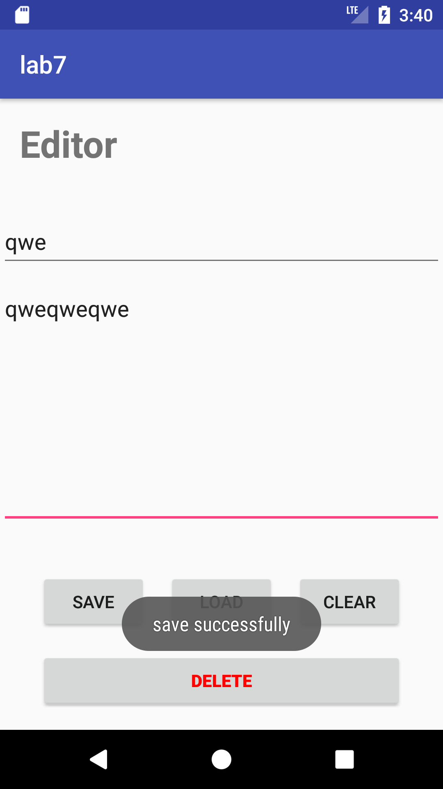

# 移动应用开发实验报告（七）

|    学号    |  姓名  |  班级  |  题目  |    时间     |
| :------: | :--: | :--: | :--: | :-------: |
| 15352306 | 檀祖冰  | 15M3 | 数据存储 | 2017/12/3 |

[TOC]

## 实验目的

* 学习SharedPreferences的基本使用
* 学习Android中常见的文件操作方法
* 复习Android界面编程。 

## 实验内容

1. 如图所示，本次实验需要实现两个activity
2. 首先，需要实现一个密码输入activity： a、 如果应用首次启动，则界面呈现出两个输入框，分别为新密码输入和确认密码输入框； b、 输入框下方有两个按钮： - OK按钮，点击之后： - 若new password为空，则弹出密码为空的提示； - 若new password与comfirm password不匹配，则弹出不匹配的提示； - 若密码不为空且互相匹配，则保存密码，进入文件编辑界面。 - CLEAR按钮，点击之后清除所有输入框的内容。 c、 完成创建密码后，退出应用再进入应用，则只呈现一个密码输入框； - 点击OK按钮后，如果输入的密码与保存的密码不匹配，则弹出Toast提示； - 点击CLEAR按钮后，清除密码输入框的内容。 d、 出于学习的目的，我们使用SharedPreferences来保存密码，但是在实际应用中我们会用更加安全的机制来保存这些隐私信息，更多可以参考链接一和链接二
3. 然后，实现一个文件编辑activity： a、 界面底部有两行四个按钮，第一行三个按钮高度一致，顶对齐，按钮水平均匀分布。按钮上方除了ActionBar和StatusBar之外的空间由标题和两个EditText占据，文件内容编辑的EditText需要占据除去其他控件的全部屏幕空间，且内部文字竖直方向置顶，左对齐； b、 在文件名输入框内输入文件名，在文件内容编辑区域输入任意内容，点击SAVE按钮后能够保存到指定文件，成功保存后弹出Toast提示； c、 点击CLEAR按钮，能够清空文件内容编辑区域内的内容； d、 点击LOAD按钮，能够按照文件名从内存中读取文件内容，并将文件内容写入到编辑框中。如果成功导入，则弹出成功的Toast提示，如果导入失败（例如：文件不存在），则弹出读取失败的Toast提示。 e、 点击DELETE按钮，能够按照文件名从内容中删除文件，删除文件后再载入文件，弹出导入失败的Toast提示。
4.  特殊要求：进入文件编辑的Activity之后，如果点击返回按钮，则直接返回Home界面，不再返回密码输入界面。 

## 实验过程

#### SharedPreferences

* 声明

  使用SharedPreferences来存储密码，需要SharedPreferences这一个对象以及它的配套编辑器，在MainActivity里添加

  ```java
  private SharedPreferences mPassSp;
  private SharedPreferences.Editor mSpEditor;
  ```

* 按 keyValue 读内容

  因为后续需要在重新进入应用的时候输入密码，所以在每次MainActivity唤醒的时候，进行密码相关的处理。

  ```java
  @Override
  protected void onResume() {
      super.onResume();
      mPassSp = getApplicationContext() //从系统存储中读取密码
              .getSharedPreferences("PASSWORD", Context.MODE_PRIVATE);
      mSpEditor = mPassSp.edit();  // 获取编辑器

      if (mPassSp.getString("PASSWORD",null)!=null) {  //如果密码存在
          has_register = true;  // 记录此时为非注册状态
          ed_pw2.setVisibility(View.INVISIBLE); // 修改确定密码输入框隐藏”
          ed_pw1.setHint("Enter your Password");// 修改密码框提示语句
          ed_pw1.setText("");
      }
  }
  ```

* 按keyValue存内容

  使用 SharedPreferences 对象配套的编辑器（SharedPreferences.Editor） 进行数据插入，如将`pw1_str`中的内容经过putString方法输入到系统的SharedPreferences中，并使用`.commit()`进行数据更新

  ```java
  mSpEditor.putString("PASSWORD", pw1_str);
  mSpEditor.commit();
  ```

#### Internal Storage

* 使用 `FileOutputStream `保存数据文件

  从EditText中读取字符串之后，将字符串转换为byte之后，保存为title对应字符值的文件

  ```java
  FileOutputStream f = getApplicationContext()
                       .openFileOutput(title, 0);
  f.write(content.getBytes());// write to a file
  f.close();
  ```

* 使用 `FileInputStream` 读取数据文件

  由于使用的是byte的方式存储的，所以先使用一个byte数据临时缓存读取出来的数据，接着再转换为string，并设置控件的文本内容

  ```java
  FileInputStream f = getApplicationContext()
                      .openFileInput(title);
  byte[] content = new byte[f.available()];
  f.read(content); // read byte from saved file
  f.close();
  ed_content.setText(new String(content));
  ```

* 使用 `deleteFile` 删除数据文件

  删除名为title的字符值的文件

  ```java
  deleteFile(title);
  ```

* 使用异常处理

  当我们使用I/O操作时，要加上异常处理的过程

  ```java
  try {
      // TODO
  }
  catch (IOException e) {
      msg = "read fail";
      e.printStackTrace();
  }
  ```

#### 按返回键返回HOME

重写`onBackPressed`, 自定义按下返回键时的动作，使用Intent+Intent.ACTION_MAIN使得程序跳转到HOME桌面

```java
@Override
public void onBackPressed() {
    super.onBackPressed();
    Intent mHomeIntent = new Intent(Intent.ACTION_MAIN);

    mHomeIntent.addCategory(Intent.CATEGORY_HOME);
    mHomeIntent.addFlags(Intent.FLAG_ACTIVITY_NEW_TASK
            | Intent.FLAG_ACTIVITY_RESET_TASK_IF_NEEDED);
    startActivity(mHomeIntent);
}
```

#### 界面

使用constrainLayout进行布局，各控件一些约束关系如下图所示

 

<p style="text-align:center"></p>

 

使得多个控件垂直居中并靠拢在一起，使用属性（水平居中修改Vertical为水平即可）

```xml
app:layout_constraintVertical_chainStyle="packed"
```

接着设置与与自己连接的控件的margin即可调整“打包”在一起的控件之间的间距

设置两个EditText两端分别约束到顶部的Editor文本框与底部的按钮，并设置第二个EditText高度为`android:layout_height="200dp"`  即可保证合适放置在中部


## 实验结果

|  |  |  |  |
| :--------------------------------------: | :-------------------------: | :-------------------: | :-------------------: |
|                 确认密码不一致                  |            注册成功             |         登陆失败          |         登陆成功          |

|  |  |  |  |
| :-----------------------: | :-----------------------: | :-----------------------: | :-----------------------: |
|           成功写入            |           读取成功            |           删除成功            |          再次读取失败           |

## 实验总结

* Internal Storage 与 External storage 主要是存储逻辑上的区别：Internal Storage 储存的数据只面向应用程序，理解为应用程序的私有数据，一般用来存储配置文件等数据，存储在 data/应用名称/ 下；而 External storage 为可以公用的数据，任何人任何程序都可以访问，一般用来存储图像、音频、视频等信息，可以存在任何地方。
* 在处理程序退到Home桌面，再次进入时，如果想要程序更新或者执行一些过程，重写onResume函数即可。在Activity的生命周期中，onCreate在此之前，而每次Activity唤醒都会执行一次onResume，正好符合了我们的需求