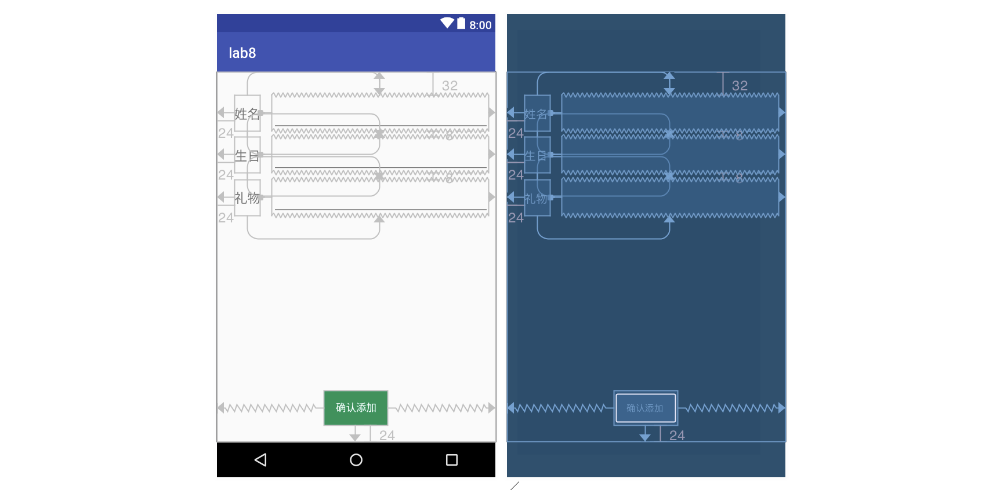
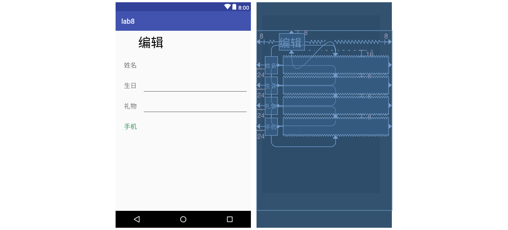
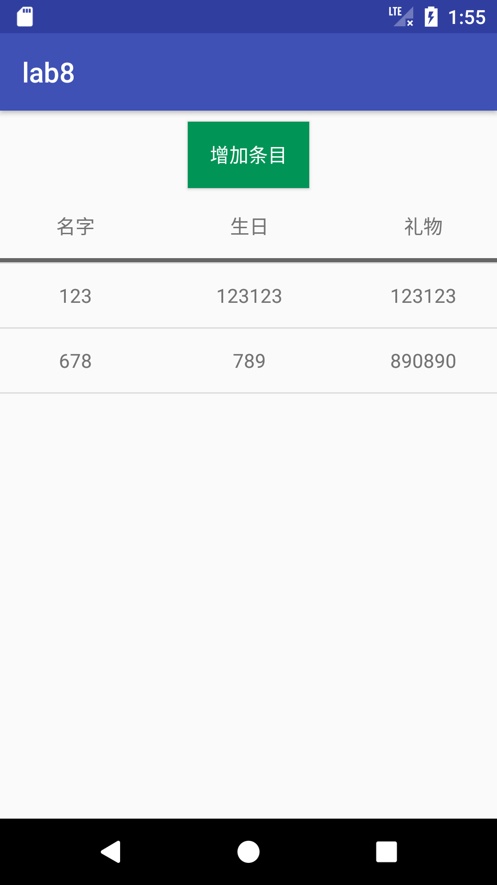
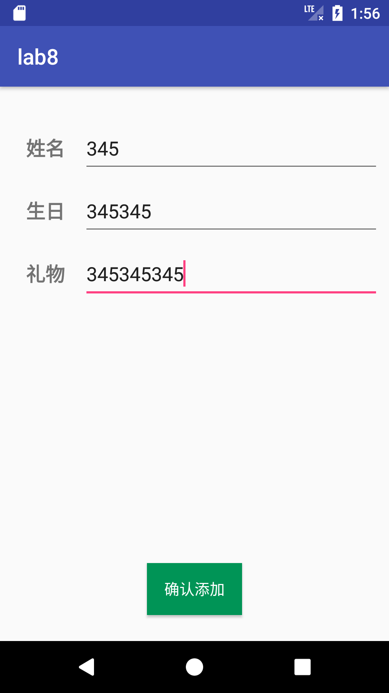
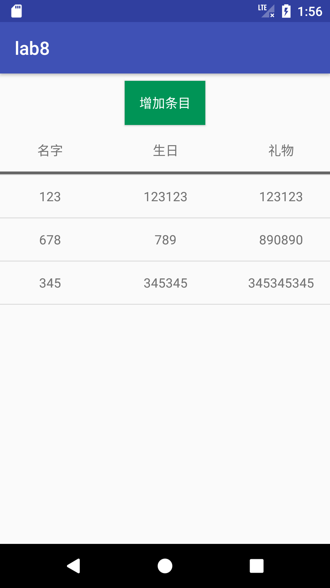
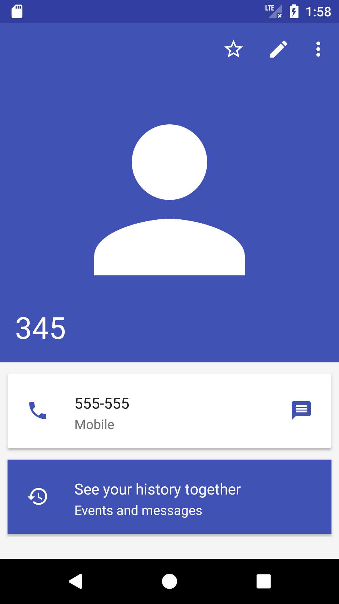
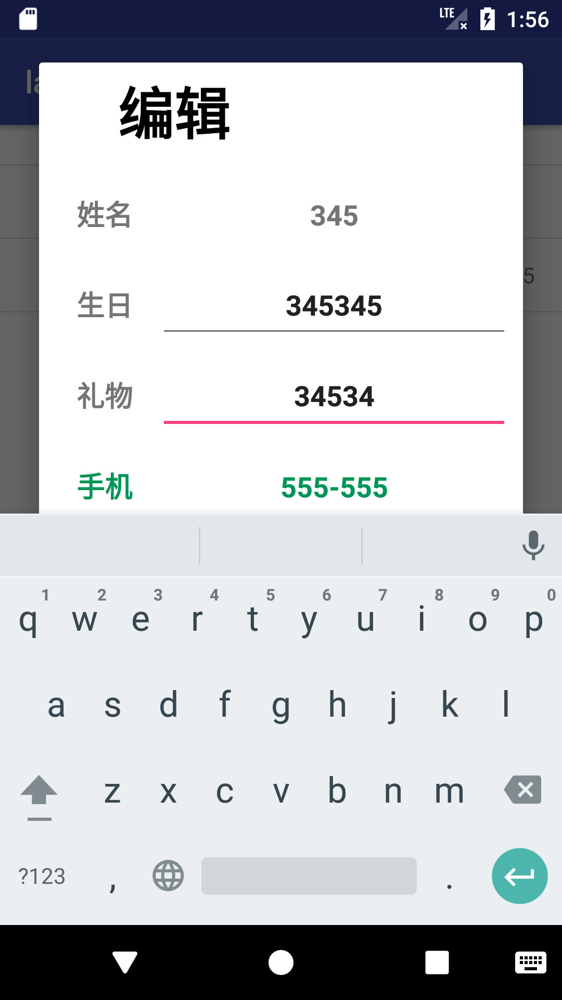
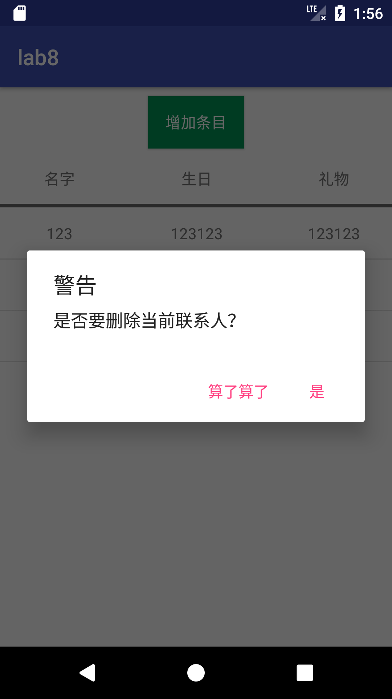
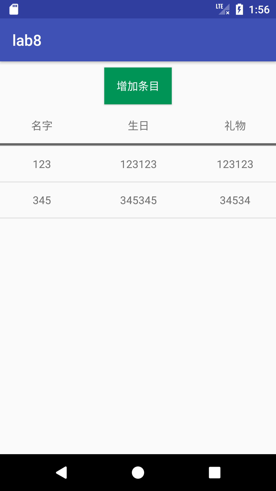

# 移动应用开发实验报告（八）

|    学号    |  姓名  |  班级  |  题目  |     时间     |
| :------: | :--: | :--: | :--: | :--------: |
| 15352306 | 檀祖冰  | 15M3 | 数据存储 | 2017/12/11 |

[TOC]

## 实验目的

数据存储--数据库  

## 实验内容

- 学习 SQL 数据库的使用
- 学习 ContentProvider 的使用
- 复习 Android 界面编程

实现一个生日备忘录，要求实现：

- 使用 SQLite 数据库保存生日的相关信息，并使得每一次运行程序都可以显示出已经存储在数据库
  里的内容；
- 使用 ContentProvider 来获取手机通讯录中的电话号码。

功能要求：

- 主界面包含增加生日条目按钮和生日信息列表；
- 点击“增加条目”按钮，跳转到下一个 Activity 界面，界面中包含三个信息输入框（姓名、生日、礼物）和一个“增加”按钮，姓名字段不能为空且不能重复；
- 在跳转到的界面中，输入生日的相关信息后，点击“增加”按钮返回到主界面，此时，主界面中应更新列表，增加相应的生日信息；

主界面列表点击事件：

- 点击条目：
  弹出对话框，对话框中显示该条目的信息，并允许修改；
  对话框下方显示该寿星电话号码（如果手机通讯录中有的话，如果没有就显示“无”）
  点击“保存修改”按钮，更新主界面生日信息列表。
- 长按条目：
  弹出对话框显示是否删除条目；
  点击“是”按钮，删除该条目，并更新主界面生日列表。

## 实验过程

#### 基础数据处理

定义一个类用于存储一个联系人，为了使此对象能够使用Intent传递需要实现接口`Serializable`

*contactItem.java*

```java
public class contactItem implements Serializable {
    String name;
    String birthday;
    String gift;
    contactItem(){
        name=birthday = gift = "";
    }
    contactItem(String name,String birthday, String gift){
        this.name = name;
        this.birthday = birthday;
        this.gift = gift;
    }
}
```

将SQLite封装一个一个便于使用的类，一定要添加上 `onUpgrade` 函数，接着设置必要的构造函数即可

*mydb.java*

```java
public class mydb extends SQLiteOpenHelper
{
    private static final String DB_NAME = "Contacts.db";
    private static final String TABLE_NAME = "Contacts";
    private static final int DB_VERSION = 1;

    // construct function 

    @Override
    public void onCreate(SQLiteDatabase db) {
        String CREATE_TABLE = "create table " + TABLE_NAME
                + " (_id integer primary key , "
                + "name text , "
                + "birth text , "
                + "gift text);";
        db.execSQL(CREATE_TABLE);
    }

    @Override
    public void onUpgrade(SQLiteDatabase db, 
    					  int oldVersion, 
    					  int newVersion) {
        //TODO
    }
}
```

可知这次的数据中更新对象为 contactItem ，为便于使用，设置一个支持 查、删、改的数据库操作函数

```java
public void dbOpe(String name, String birthday, String gift, Integer type)
{
    SQLiteDatabase db = getWritableDatabase();
    String []exc_sql = new String[]{
        String.format("INSERT INTO %s (name,birth,gift) VALUES ('%s','%s', '%s');",
                    TABLE_NAME,name,birthday,gift),
        String.format("UPDATE %s SET birth = '%s', gift = '%s' WHERE name='%s';",
                    TABLE_NAME,birthday,gift,name),
        String.format("DELETE FROM '%s' WHERE name='%s';",TABLE_NAME,name)
    };
    db.execSQL(exc_sql[type]);
}
```

以及一个 包含全部数据库中存有的联系人信息列表的函数

```java
public List<contactItem> selectAll()
{
  	SQLiteDatabase db = getReadableDatabase();
  	List<contactItem> newList = new ArrayList<>();
  	String select_all = "SELECT * FROM "+TABLE_NAME;
  	Cursor cursor = db.rawQuery(select_all,null);
  	while (cursor.moveToNext()) {

    	newList.add(new contactItem(cursor.getString(1),
                                cursor.getString(2),
                                cursor.getString(3)));
  	}
  	cursor.close();
  	db.close();
  	return newList;
}
```

继续添加一个Activity用于新增联系人，使用约束布局设置界面，在点击保存后如果经过了检验则传回一个contactItem到主页中



在检查了用户名的合理性成功之后，将对象返回

```java
Intent mIntent = new Intent(AddItemActivity.this,
                            MainActivity.class);
Bundle mBundle = new Bundle();
mBundle.putSerializable("newContact", 
                        new contactItem(name,birthday,gift));
mIntent.putExtras(mBundle);
setResult(0x1234, mIntent);
finish();
```

在MainActivity中添加监听, 当每一次编辑完成之后，进行数据库的插入操作，此外需要注意检查数据是否为空

```java
@Override
protected void onActivityResult(int requestCode, 
                                int resultCode, 
                                Intent data) {
    if (requestCode == 0x1234 && data!=null) {
        contactItem newContact = (contactItem) 
                data.getSerializableExtra("newContact");
        mdb.dbOpe(newContact.name,
                newContact.birthday,
                newContact.gift,0);
        updateList();
    }
}
```

#### 获取联系人

获取联系人是一个使用系统API进行查询的过程

* 使用`getContentResolver.query()`函数进行查询，使用时指定所要查询的数据类型为设备中的`.Phone.CONTENT_URI` ，并设置查询的行为 `.Phone.DISPLAY_NAME=name` 
* 查询结果为一个 Cursor 指针，使用这一个Cursor指针成员函数 `moveToNext()` 遍历所有`Phone.DISPLAY_NAME` 为所需要对应名字的行，并记录到数组中
* 如果没有查询到对应的用户则会触发异常，由try函数处理，并返回"无此人联系方式"

```java
try{
    Cursor phone = getContentResolver()
      .query(ContactsContract.CommonDataKinds.Phone.CONTENT_URI,
            null,
            ContactsContract.CommonDataKinds
                            .Phone.DISPLAY_NAME + "= " + name,
            null,
            null);
    String Number = "";
    while(phone.moveToNext())  {
        Number += phone.getString(
                        phone.getColumnIndex(ContactsContract
                                             .CommonDataKinds
                                             .Phone.NUMBER));
    }
    phone.close();
    return Number.isEmpty()?"无此人联系方式":Number;
}
catch (Exception e){
    return  "无此人联系方式";
}
```

#### AlertDialog 的自定义界面

添加一个页面布局 



在AlertDialog 建立的之后设置

```java
new AlertDialog.Builder(MainActivity.this)
                        .setView(alertDialogView)
  						.show()
```


## 实验结果

|  |  |  |  |
| :-------------------: | :-----------------: | :-------------------: | --------------------------------- |
|         初始界面          |      增加联系人 345      |        成功添加联系人        | 查看联系人中的345                        |

|  |  |  |  |
| :----------------------------: | :-------------------------: | :----------------------------------: | :---------------------: |
|       修改345,同时可看到显示了手机号码       |           成功修改345           |                长按678                 |         已删除678          |


## 实验总结

* 这次主要是学会使用安卓中SQLite的接口使用，其实只需要使用标准的SQL语句，再直接调用api执行即可
* 这一次还有一个坑就是Alerdialog中获取EditText，在AlertDialog没有初始化之前，那些在AlertDialog上的控件都不初始化，所以只能在每次oclick的时候从AlertDialog上寻找，但是代价并不大因为AlertDialog只有比较少的子元素

