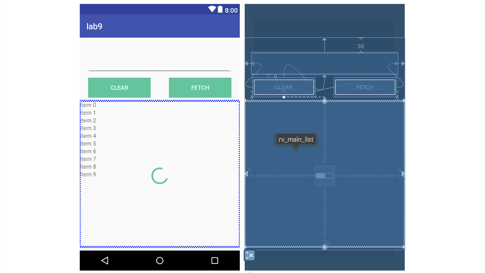
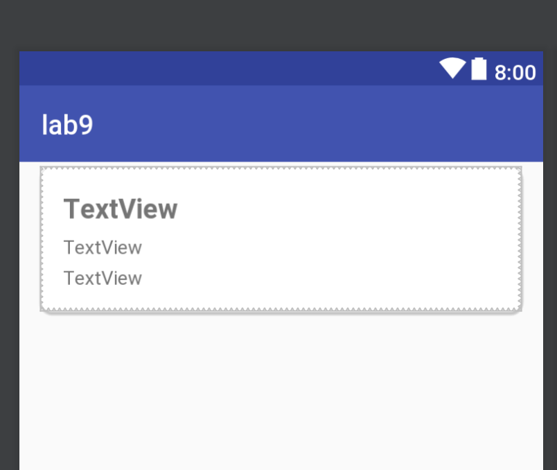
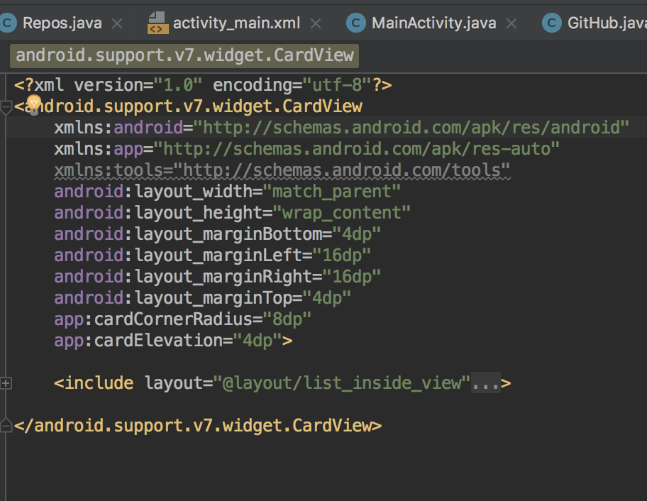
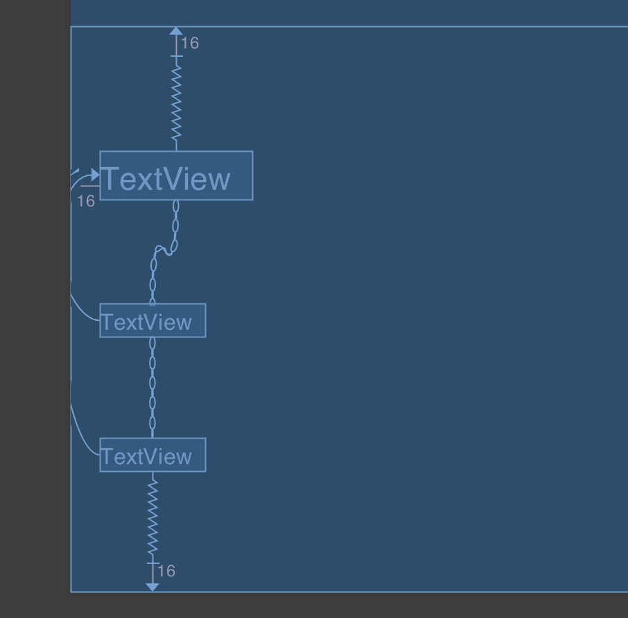
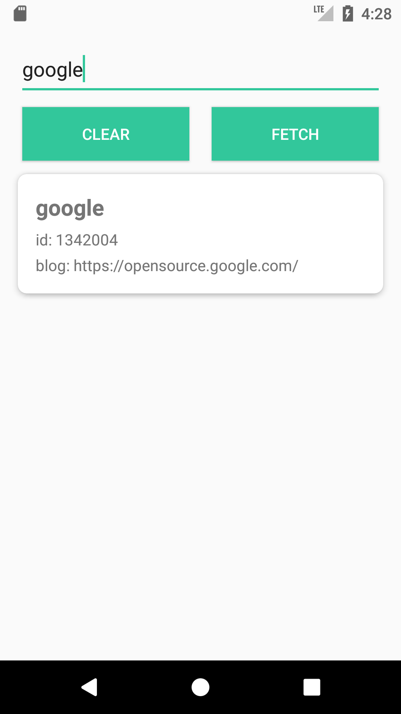
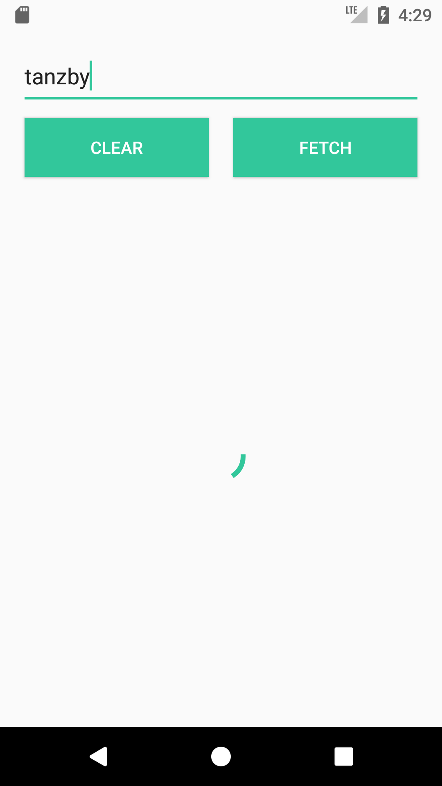
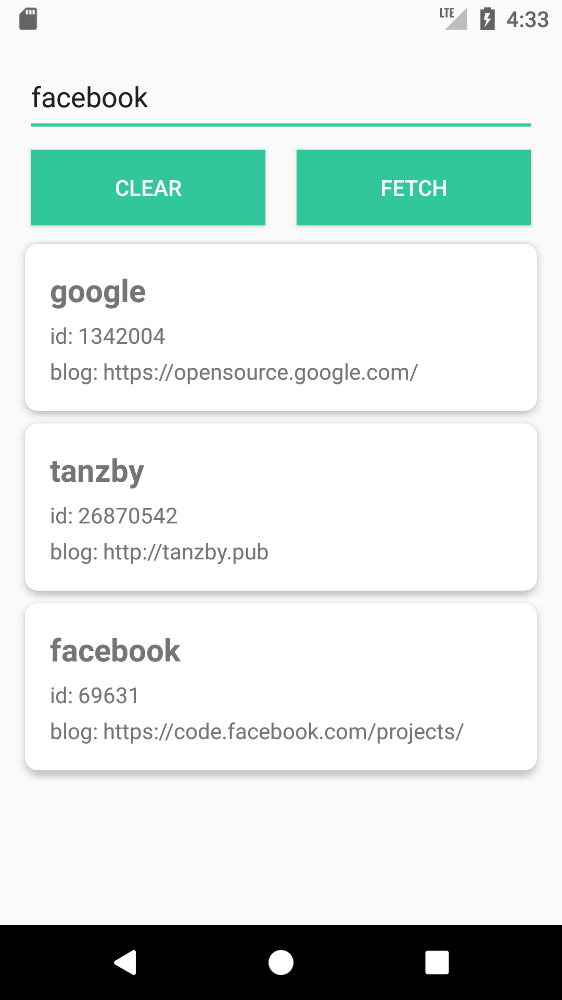
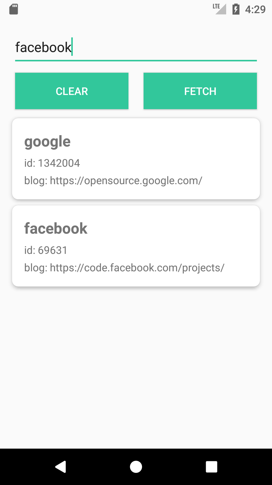
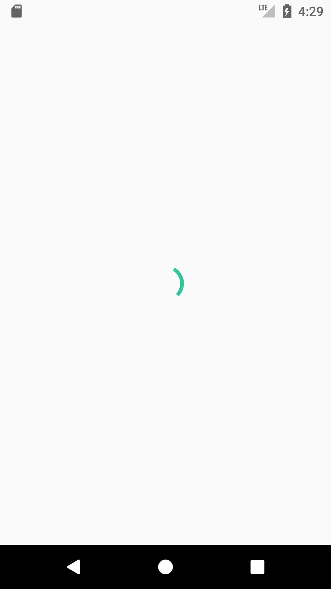
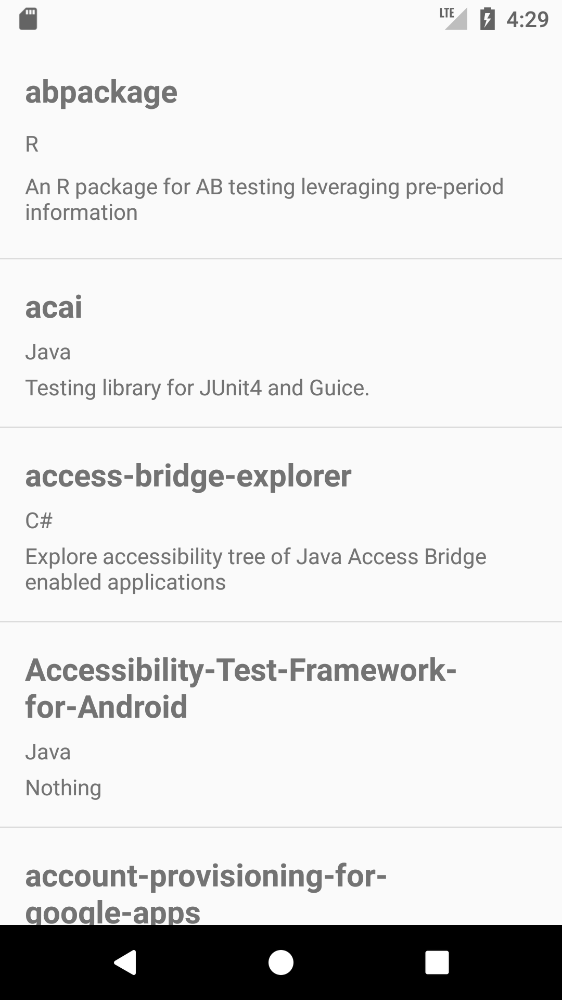

# 移动应用开发实验报告（九）

|    学号    |  姓名  |  班级  |  题目  |     时间     |
| :------: | :--: | :--: | :--: | :--------: |
| 15352306 | 檀祖冰  | 15M3 | 数据存储 | 2017/12/14 |

[TOC]

## 实验目的

* 学习使用Retrofit实现网络请求
* 学习RxJava中Observable的使用
* 复习同步异步概念 

## 实验内容

- 使用GitHub API 完成 查找用户显示其name、id、blog
- 点击查找到的用户，可显示用户所有的Repository

## 实验过程

### 建立数据模型

为了便于供给网络请求接口处理数据，定义了两个模型分别用于存储用户与存储用户的Repos，这两个模型的变量名字必须与GitHubAPI返回的Json数据中的key值相同. 并且为了方便统一使用，将几个getter方法统一命名

*GitHub.java*

```java
public class GitHub {
    private String login;
    private String blog;
    private String id;

    public GitHub(String id, String blog, String login){
        this.id=id;
        this.blog=blog;
        this.login=login;
    }

    public String getSub1(){return id;}
    public String getSub2() {return blog;}
    public String getTitle()   {return login;}
}
```

*Repos.java*

```java
public class Repos {
    private String name;
    private String description; 
    private String language;
    
    public String getTitle() {
        return name;
    }

    public String getSub2() {
        if(description==null ||  description.isEmpty()) return "Nothing";
        return description;
    }

    public String getSub1() {
        if (language==null || language.isEmpty()) return "Unknown";
        return language;
    }
}
```

### 建立Github API接口

建立一个final类，类中定义两个用于请求的API, 它们都接受一个用户名字符串，通过GET方法和API进行请求。而返回参数`Observable<T>`将会返回一个“被订阅者”，订阅者可以通过实例化Observable对象并绑定订阅进行相应的数据接收。

```java
public final class ServiceFactory {
    //retrofit对象提供相应的访问Github用户名以及其repos的的API
    public interface GitHubService{
        @GET("/users/{user}")
        Observable<GitHub> getUser(@Path("user") String user);

        @GET("users/{user}/repos")
        Observable< List<Repos> > getUserRepos(@Path("user") String user);
    }
}
```

### 请求设计

先保证设备可以有权限进行网络访问，在`AndroidManifest.xml`中添加

```xml
<uses-permission android:name="android.permission.INTERNET" />
```

若为安卓6.0还需动态添加权限

```java
private static String[] PERMISSIONS_INTERNET = {
    Manifest.permission.INTERNET
};

public static void verifyInternetPermissions(Activity activity)
{
  int permission = ActivityCompat
     .checkSelfPermission(activity,
                          Manifest.permission.INTERNET);

  if (permission != PackageManager.PERMISSION_GRANTED) {
    ActivityCompat.requestPermissions(
      activity,PERMISSIONS_INTERNET, 1);
  }
}
```

使用`retrofit` 与`RXJava`处理API请求经过以下两步

* 创建一个 `Retrofit`对象，这个对象用于设定网络的访问属性，如设置请求链接时超时的阈值、数据返回时如何解析等属性
* 创建一个订阅者`Observer<>` ，重写订阅时、完成时、发生错误时、得到下一个结果时的事件
* 使用`Retrofit`对象创建一个我们定义的网络API接口的连接，并设置API连接所在的线程、请求结果的订阅者

#### 创建`Retrofit`对象

可在`ServiceFactory`中添加一个用于创建Retrofit客户端的方法，方便直接调用并获取一个设定好参数的Retrofit客户端。其中这一个客户端设置了读取超时为10s、连接超时为9s，在DEBUG模式下设置网络请求的断点中断支持，最后是设置api接口的基地址、数据转换的接口（用于把Json转换为model的GsonConverterFactory）、以及消息处理的回调接口（RxJava2CallAdapterFactory）

```java
/**
* 使用特定的参数设置创建一个Retrofit客户端
* @return 创建的Retrofit客户端
*/
public static Retrofit createRetrofit()
{
  OkHttpClient.Builder builder = new OkHttpClient().newBuilder();
  builder.readTimeout(10, TimeUnit.SECONDS);
  builder.connectTimeout(9, TimeUnit.SECONDS);

  if (BuildConfig.DEBUG) {
    HttpLoggingInterceptor interceptor = new HttpLoggingInterceptor();
    interceptor.setLevel(HttpLoggingInterceptor.Level.BODY);
    builder.addInterceptor(interceptor);
  }

  return new Retrofit.Builder().baseUrl(API_URL)
    .client(builder.build())
    .addConverterFactory(GsonConverterFactory.create())
    .addCallAdapterFactory(RxJava2CallAdapterFactory.create())
    .build();
}
```

#### 定义订阅者

在实验中有两种订阅者——订阅user信息、订阅user的Repos，但两者的写法基本一致，期中订阅user的Observer对象为

```java
github_obs = new Observer<GitHub>() {
    @Override
    public void onSubscribe(Disposable d) {
        Log.i("github_obs","Subscribe");
        loading.setVisibility(View.VISIBLE);
        rv_main_list.setVisibility(View.INVISIBLE);
    }
    @Override
    public void onNext(GitHub gitHub) {
        Log.i("github_obs","onNext");
        rv_main_list_adapter.addiItem(gitHub);
    }
    @Override
    public void onError(Throwable t) {
        Log.i("github_obs","onError thowable"+t);
        Toast.makeText(MainActivity.this,"连接发生错误",Toast.LENGTH_SHORT).show();;
    }
    @Override
    public void onComplete() {
        System.out.println("完成传输");
        loading.setVisibility(View.INVISIBLE);
        rv_main_list.setVisibility(View.VISIBLE);
    }
};
```

以上代码做了这几件事

* 实例化了一个返回结果为 GitHub类型的Observer
* Observer 开始订阅时，设置ProgressBar动画触发而列表消失，提示用户正在加载
* Observer 发生错误时，设置提醒信息“连接发生错误”
* Observer 在接收到下一个 GitHub对象时，意味着传输已经完成，这是调用函数添加一个列表项
* Observer 在完成传输时，设置ProgressBar动画消失而列表重新消失，把结果展示给用户

在Repos中，由于没有使用RecyclerView，而是`SimpleAdapter`+`ListView`的组合，完成传输时的执行代码为

```java
@Override
public void onNext(List<Repos> repos) {
  Log.i("repos_obs","onNext size = "+repos.size());
  List<HashMap<String,String>> data = new ArrayList<>(repos.size());
  for (Repos r: repos)
  {
    HashMap<String,String> m = new HashMap<>();
    m.put("title",""+r.getTitle());
    m.put("sub1",""+r.getSub1());
    m.put("sub2",""+r.getSub2());
    data.add(m);
  }
  SimpleAdapter sm= new SimpleAdapter(ReposActivity.this,
                                      data,
                                      R.layout.list_inside_view,
                                      new String[]{"title","sub1","sub2"},
                                      new int[]{R.id.tv_title,
                                                R.id.tv_sub_1,R.id.tv_sub_2}
                                     );
  lv_repos_list.setAdapter(sm);
}
```

#### 设置订阅

有了发送的和订阅的，接下来要定义方法去实现输入一个用户名，通过这个用户名调用api，通过网络通信获取相应的信息并展示。故在MainActicity中设置一个方法

```java
private void getName(String name)
{
    Retrofit retrofit = ServiceFactory.createRetrofit();
    ServiceFactory.GitHubService g =  retrofit.create(ServiceFactory
                                                   .GitHubService.class);
    Observable<GitHub> observable = g.getUser(name);
    observable.subscribeOn(Schedulers.io())
              .unsubscribeOn(Schedulers.io())
              .observeOn(AndroidSchedulers.mainThread())
              .subscribe(github_obs);

}
```

以上代码完成了

* 根据预设参数实例化了一个网络请求客户端 `retrofit`
* 通过这一个客户端创建了一个api请求接口 `g`
* 设置一个 Observable 对象用于准备进行api的执行，可认为 `observable`为一个生产者
* 设置`observable`订阅时、结束订阅和接受时所在的线程（一般来说是使用代码中的配置），并设置下游的订阅者为`github_obs`, 一个`Observer`对象

通过调用这一个方法，在接收到请求api得到的结果之后，会在`github_obs`所设定的事件中处理结果

### 界面设计

依然使用了ConstrainLayout作为主界面设置的根，布局如下



重点在于

* 输入框左右约束 16dp，接着两个按钮分别左右约束到输入框的左右，右按钮基线对齐到左按钮，左按钮上约束到输入框的底部
* RecyclerView 设置为左右约束到父元素，并设置Margin为0 ，ProgressBar设置上下左右都约束到RecyclerView，使其居于列表都中央

接着设置列表项。每一个列表项又=由CardView构成，需要注意为了可以显示阴影，必须设置margin预留部分空间使其可以完全显示。并且为了使得列表可以在其他部分被复用（主页与Repos两个地方都需要listItem），便独立成一个xml

|  |  |  |
| :---------------------------: | :-------------------: | :-------------------: |
|         CardView列表样式          |   CardView使用include   |     定义的公用list项样式      |


## 实验结果

|  |  |  |
| :-----------------------------: | :-----------------------: | :-----------------------: |
|           寻找“google”            |         寻找自己的加载动画         |          寻找了三个用户          |

|  |  |  |
| :---------------------: | :---------------------------: | :--------------------------------------: |
|          把自己删掉          |       点击google进入查找repos       |            显示google 的所有repos             |

## 实验总结

进行一个API的get请求动作需要完成

* 创建 Retrofit客户端
* 使用 Retrofit客户端 创建一个 API连接对象
* 设置API连接对象订阅与接收所在线程并指定订阅者
* 在订阅者中重写相关的事件